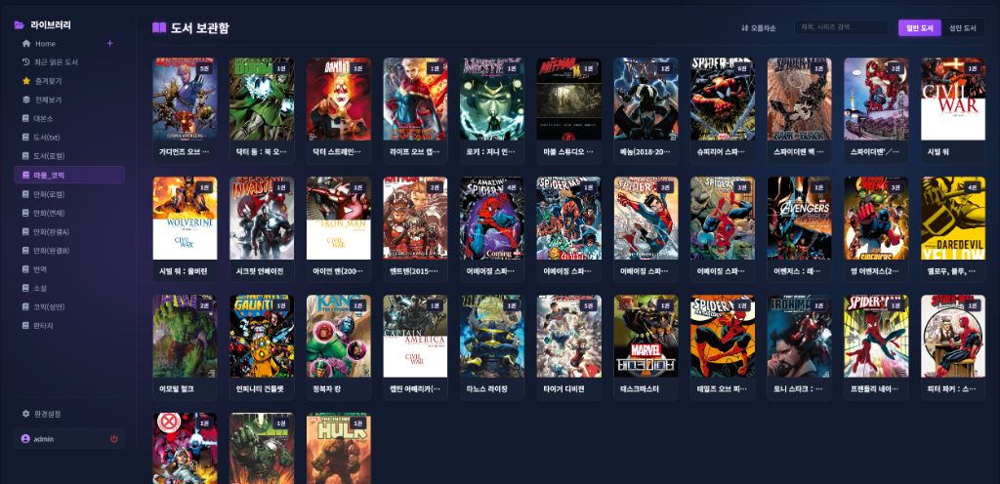

# BookOasis (북 오아시스)

<p align="center">
  
  
  
  
  
  
</p>

[English Version (README_EN.md)](./README_EN.md)

북 오아시스는 ZIP/CBZ 압축 파일 형태의 도서 및 만화책을 웹 환경에서 지연 없이 감상할 수 있도록 설계된 초경량, 고성능 개인 미디어 서버입니다.

서드파티 종속성을 극도로 최소화하고 파이썬 표준 라이브러리의 잠재력을 활용하여 가볍고 빠른 구동 환경을 제공합니다.

---

## 주요 특징

* 파일 무해제 실시간 스트리밍
  - 대용량 압축 파일(ZIP/CBZ)을 서버 디렉터리에 미리 압축 해제하지 않습니다. 
  - 내장 zipfile 모듈을 제어하여 필요한 페이지의 물리적 바이트 시작 오프셋만 읽어 스트리밍 전송하므로 디스크 I/O와 CPU 소모를 혁신적으로 절감합니다.

* 미니멀한 종속성
  - Flask 프레임워크 외에 무거운 ORM이나 서드파티 모듈을 배제했습니다.
  - 내장 SQLite 모듈에 고성능 커넥션 풀링과 정밀 쿼리를 입혀 성능 저하 없는 초경량 아키텍처를 실현했습니다.

* 최적화된 프론트엔드 파이프라인
  - 뷰포트 내 카드만 로드하는 지연 로딩(Lazy Loading) 및 다음 페이지 프리로딩(Preloading)을 지원하여 끊김 없는 독서 경험을 보장합니다.

* 유연한 메타데이터 플러그인
  - 플러그인 아키텍처를 내장하여 국내 환경에 특화된 알라딘 Open API 등의 외부 정보 수급 채널을 플러그인 형태로 제어합니다.
  - 책 소개글, 작가 정보, 고화질 커버를 원클릭으로 통합 반영하며 수동 메타데이터 편집기 및 표지 교체를 지원합니다.

* 모바일 뷰어 호환
  - 외부 뷰어 애플리케이션 연동을 위한 OPDS 규격을 지원하며, 데이터베이스 인증정보 기반의 Basic Authentication 보안 처리를 적용했습니다.

### 🎨 4컷 만화로 보는 BookOasis 구동 원리

BookOasis가 대용량(10만 권 이상) 환경에서도 버벅임 없이 초광속으로 동작하는 비밀입니다! 


* **초고속 스캐너**: 도서의 압축파일을 해제하지 않고 최소 오프셋만 읽어 순식간에 메타데이터를 추출해 DB에 시딩합니다.
* **지연(Lazy) 스캐너**: 용량이 큰 만화책 ZIP 파일 등은 무리하게 즉시 파싱하지 않고 백그라운드에서 나른하게 비동기 처리하여 메인 동작의 렉을 차단합니다.

---

### 대시보드 화면



---

## 시작하기

상세한 환경 구성 및 설치 방법은 기술 문서를 참조하십시오.

* 설치 안내: [설치 가이드 (docs/guide_installation.md)](./docs/guide_installation.md)
* 카비타 이사하기: [마이그레이션 가이드 (docs/migration_guide.md)](./docs/migration_guide.md)
* 관리 및 관리자 설정: [관리자 가이드 (docs/guide_admin.md)](./docs/guide_admin.md)
* 모바일 뷰어 연동: [OPDS 연동 가이드 (docs/guide_opds.md)](./docs/guide_opds.md)
* 아키텍처 및 소스 구조: [아키텍처 가이드 (docs/guide_architecture.md)](./docs/guide_architecture.md)
* 플러그인 개발 정보: [플러그인 개발 가이드 (docs/guide_plugins.md)](./docs/guide_plugins.md)
* 표준 이벤트 웹훅 명세: [API 엔드포인트 명세 (docs/api_endpoints.md)](./docs/api_endpoints.md#-6-외부-연동-및-자동화용-웹훅-api-webhook)
* 위키 포털: [기술 위키 홈 (docs/index.md)](./docs/index.md)

> 이벤트 웹훅(`book.new`, `book.read`, `book.finish`)은 포맷별 진행률 제약을 반영합니다. EPUB/TXT는 물리 페이지가 고정되지 않아 `totalPages`가 `null`일 수 있으며, 수신 측에서는 `progress`(0~100)를 우선 처리하는 것을 권장합니다.

### 간편 구동 (Docker)

1. **설정 템플릿 복사**
   로컬 환경 고유 설정을 위해 제공되는 오버라이드 템플릿 파일을 복사합니다.
   ```bash
   cp docker-compose.override.example.yml docker-compose.override.yml
   ```

2. **볼륨 경로 수정**
   생성된 `docker-compose.override.yml` 파일을 열어 본인의 실제 책/만화책 라이브러리 디렉토리 경로로 수정합니다.
   ```yaml
   services:
     bookoasis:
       volumes:
         - /실제/책/저장/경로:/data/comics:ro
   ```

3. **컨테이너 실행**
   ```bash
   docker compose up -d --build
   ```
> **Tip:** `docker-compose.override.yml`은 `.gitignore`에 등록되어 있으므로 향후 프로젝트 소스가 업데이트되어 `git pull`을 받아도 사용자의 개인 경로 설정 파일이 충돌을 일으키거나 유실되지 않습니다.

> 보안 정책에 따라 운영자용 배포/업데이트 절차는 비공개 내부 문서로 관리합니다.

### 직접 구동 (Native Python)

#### 🐧 Linux / macOS 환경
```bash
# 가상환경 활성화 및 종속성 설치
python -m venv venv
source venv/bin/activate
pip install -r requirements.txt

# 설정 파일 구성
# .env 내 SECRET_KEY 항목에 자신만의 임의의 긴 문자열을 입력하여 보안 고정 키를 생성합니다.
# 이 키를 고정해 주시면 서버 기동 프로세스가 재시작되더라도 사용자 세션(로그인 상태)이 풀리지 않고 안전하게 유지됩니다.

# 서버 기동
python core.py
```
* 기본 동작: 도커 외 환경에서는 스캐너 워커가 자동으로 함께 기동되어 큐 대기열(`pending`)을 처리합니다.
* 필요 시 비활성화: `BOOKOASIS_ENABLE_EMBEDDED_WORKER=0 python core.py`

#### 🪟 Windows 환경
윈도우 환경에서는 마우스 더블클릭 한 번으로 구동 디렉토리 생성 및 패키지 설치부터 프로덕션 수준의 웹 서버(`waitress`) 실행까지 자동으로 원클릭 셋업해 주는 배치 파일을 제공합니다.

1. `.env.example` 파일을 복사하여 `.env` 파일로 이름 변경 후 필요한 설정 입력.(SECURITY_KEY)
2. 프로젝트 루트의 **`run_windows.bat`** 파일을 마우스 더블클릭하여 기동.

* `run_windows.bat`는 웹 서버와 스캐너 워커를 함께 기동하도록 구성되어 있습니다.

* 로컬 포트: `http://localhost:5930`

---

## 🔑 초기 로그인 및 계정 정보
- 최초 서버 구동 후 로그인 시 아래의 관리자 계정을 사용하여 접속할 수 있습니다.
  - **사용자 이름(ID)**: `admin`
  - **비밀번호**: `admin`
- **보안 권장**: 첫 로그인 후 즉시 [설정] > [계정 관리] 탭에서 관리자 비밀번호를 변경해 주세요.

---


## 🛡️ 프록시 헤더 인증 (Proxy Header Auth / SSO) 가이드

해외 홈랩 유저 및 OIDC 연동을 위해 **Proxy Header Auth (리버스 프록시 자동 로그인)** 기능을 지원합니다.
Authelia, Authentik 등 앞단의 리버스 프록시 인증 서버가 검증을 마치고 전달하는 HTTP 헤더(`Remote-User` 또는 `X-Forwarded-User`) 값을 신뢰하여 자동으로 BookOasis에 로그인(SSO)시킬 수 있습니다.

> [!CAUTION]
> **심각한 보안 경고**
> 이 기능은 반드시 Nginx, Authelia 등 **리버스 프록시가 헤더를 변조 및 보호하는 폐쇄망 환경**에서만 활성화해야 합니다!
> 프록시 없이 인터넷에 개방된 상태에서 이 옵션을 켤 경우, 악의적인 사용자가 헤더 조작(예: `Remote-User: admin`)만으로 관리자 권한을 탈취할 수 있는 심각한 취약점이 됩니다. 위험성을 충분히 인지한 분만 사용하세요.

**설정 방법:**
1. 어드민 계정으로 로그인 후 **일반 설정** 메뉴에 진입합니다.
2. 스크롤을 내려 **Proxy Header Auth (리버스 프록시 자동 로그인)** 항목을 찾아 토글합니다.
3. 설정을 저장한 뒤, 앞단의 Nginx/프록시 서버가 올바른 사용자명 헤더를 BookOasis 로 넘겨주도록 구성하십시오.

**선택 보안 옵션 (권장):**
- `PROXY_HEADER_TRUSTED_IPS`: 프록시 원본 IP/CIDR 화이트리스트 (예: `127.0.0.1,10.0.0.0/8,192.168.0.0/16`)
  - 이 값이 설정되면, 화이트리스트에 없는 소스 IP에서 전달된 `Remote-User`/`X-Forwarded-User` 헤더는 무시됩니다.
- `PROXY_HEADER_DENY_DIRECT`: `1`로 설정 시, 프록시 헤더가 없는 직접 접속을 거부 (reverse proxy 경유 강제)

> 위 옵션은 DB 설정(`settings` 테이블) 또는 환경변수(`.env`)로 설정할 수 있습니다. DB 설정값이 우선 적용됩니다.

---

## Nginx 설정 가이드

1. 전역 설정 (nginx.conf) 업데이트
Cloudflare를 통하는 요청은 일반적인 요청보다 헤더 크기(쿠키, 인증 토큰, 프록시 헤더 등)가 훨씬 비대합니다. Nginx의 기본 헤더 버퍼 크기가 작으면 서버가 요청을 거부하고 400 Bad Request 또는 414 Request-URI Too Large 에러를 반환합니다.

이를 방지하기 위해 /etc/nginx/nginx.conf 파일의 http { ... } 블록 내부에 아래 설정을 반드시 추가하거나 확장해 주세요.
```
http {
    # ------------------------------------------------------------------
    # [Cloudflare 및 대용량 헤더 대응] 버퍼 크기 대폭 확장
    # 쿠키 및 인증 헤더가 길어질 때 발생하는 4XX 에러를 원천 차단합니다.
    # ------------------------------------------------------------------
    client_header_buffer_size 16k;
    large_client_header_buffers 4 64k;

    # ------------------------------------------------------------------
    # 프록시 헤더 해시 크기 최적화
    # 다수의 복잡한 X-Forwarded-* 헤더가 유입되어도 해시 테이블 오버플로우가 나지 않도록 합니다.
    # ------------------------------------------------------------------
    proxy_headers_hash_max_size 1024;
    proxy_headers_hash_bucket_size 128;

    # (기존의 다른 설정들...)
}
```

2. BookOasis 가상 호스트 설정 (sites-available)
/etc/nginx/sites-available/default 파일(또는 가상 호스트 설정 블록)에 아래 내용을 작성하고, sites-enabled에 심볼릭 링크를 걸어 적용합니다.

```
server {
    listen 80;
    server_name your-domain.com; # <== 본인의 도메인으로 변경하세요.

    # HTTP로 들어오는 요청을 HTTPS로 강제 리다이렉트 (보안)
    if ($http_x_forwarded_proto = "http") {
        return 301 https://$host$request_uri;
    }

    # ------------------------------------------------------------------
    # Gzip 텍스트 압축 설정 (UI 및 JSON API 가속)
    # 이미지 바이너리는 압축하지 않고, 텍스트 자원만 압축하여 CPU 자원을 아낍니다.
    # ------------------------------------------------------------------
    gzip on;
    gzip_disable "msie6";
    gzip_vary on;
    gzip_proxied any;
    gzip_comp_level 6;
    gzip_types text/plain text/css application/json application/javascript text/xml application/xml;

    # 알라딘 메타데이터 플러그인 등 커버 이미지 업로드를 고려한 최대 바디 크기 제한
    client_max_body_size 100M;

    # ------------------------------------------------------------------
    # 보안 헤더 주입
    # ------------------------------------------------------------------
    add_header X-Frame-Options "SAMEORIGIN" always;         # 클릭재킹 방지
    add_header X-Content-Type-Options "nosniff" always;     # MIME 스니핑 방지
    add_header Referrer-Policy "no-referrer-when-downgrade" always;

    # ------------------------------------------------------------------
    # 메인 어플리케이션 프록시 라우팅
    # ------------------------------------------------------------------
    location / {
        proxy_pass http://127.0.0.1:5930/; # BookOasis 내부 구동 포트

        # [기본 프록시 헤더 설정]
        # $host 대신 $http_host를 사용하여 외부 포트 및 Cloudflare 호환성을 완벽히 유지합니다.
        proxy_set_header Host $http_host; 
        proxy_set_header X-Real-IP $remote_addr;
        proxy_set_header X-Forwarded-For $proxy_add_x_forwarded_for;
        proxy_set_header X-Forwarded-Proto $http_x_forwarded_proto;

        # [WebSocket 및 HTTP/1.1 프로토콜 업그레이드 지원]
        proxy_http_version 1.1;
        proxy_set_header Upgrade $http_upgrade;
        proxy_set_header Connection "upgrade";

        # --------------------------------------------------------------
        # [CRITICAL] 대용량 파일 전송 최적화 (프록시 버퍼링 끔)
        # BookOasis의 핵심 기능인 '오프셋 기반 실시간 스트리밍'이 Nginx 임시 
        # 버퍼에 가로막히지 않고 브라우저 뷰어에 지연 없이 다이렉트로
        # 전달되도록 합니다. 디스크 I/O와 메모리 낭비를 방어하는 핵심 설정입니다.
        # --------------------------------------------------------------
        proxy_buffering off;

        # [타임아웃 확장] 대용량 스캔 프로세스 및 외부 AI 분석 장시간 작업 대응
        proxy_read_timeout 300;
        proxy_connect_timeout 300;
        proxy_send_timeout 300;
    }
}
```

---

## Caddy 설정 가이드

Nginx 대신 Caddy를 리버스 프록시로 사용하는 경우 아래와 같이 Caddyfile을 구성하여 최적화 및 연동을 진행할 수 있습니다. Caddy는 자동으로 SSL 인증서(HTTPS)를 발급 및 관리해주며, WebSocket과 리버스 프록시 헤더 처리를 기본 내장하고 있습니다.

`/etc/caddy/Caddyfile` 파일에 본인의 도메인을 매핑하여 다음과 같이 내용을 구성합니다.

```caddy
your-domain.com { # <== 본인의 도메인으로 변경하세요.
    # ------------------------------------------------------------------
    # Gzip 및 Zstd 텍스트 압축 설정 (UI 및 JSON API 가속)
    # ------------------------------------------------------------------
    encode gzip zstd

    # ------------------------------------------------------------------
    # 최대 바디 크기 제한 (Nginx client_max_body_size 100M 대응)
    # 알라딘 메타데이터 플러그인 등 커버 이미지 업로드를 고려한 한도입니다.
    # ------------------------------------------------------------------
    request_body {
        max_size 100mb
    }

    # ------------------------------------------------------------------
    # 메인 어플리케이션 프록시 라우팅
    # ------------------------------------------------------------------
    reverse_proxy 127.0.0.1:5930 {
        # [CRITICAL] 대용량 파일 전송 최적화 (프록시 버퍼링 비활성화)
        # BookOasis의 핵심 기능인 '오프셋 기반 실시간 스트리밍'이 프록시 버퍼에
        # 가로막히지 않고 즉시 전송되도록 설정합니다.
        flush_interval -1
    }
}
```

변경 완료 후 `sudo systemctl reload caddy` 명령을 통해 Caddy 설정을 갱신합니다.

## 라이선스 및 상표권 정보

* **오픈소스 라이선스**: 본 프로젝트는 [GNU AGPLv3 (Affero General Public License v3.0)](./LICENSE) 규격을 따릅니다. 누구나 소스 코드를 열람, 수정, 배포할 수 있으며, 이 소프트웨어를 기반으로 한 서비스(네트워크를 통한 서비스 포함)를 제공할 경우 반드시 수정된 소스 코드를 동일한 AGPLv3 라이선스로 공개해야 합니다. 자세한 약관은 LICENSE 파일을 참조하십시오.
* **상표권 보호 가이드라인**: "BookOasis" 명칭 및 관련 공식 로고 이미지는 원작자의 고유 식별 상표(Trademark)로 보호됩니다. 본 프로그램을 포크(Fork) 및 변경하여 재배포 시 원본 소스코드의 저작권 표기는 성실히 준수하되, 동일한 명칭("BookOasis")과 공식 로고를 제품명에 사용하여 재배포할 수 없으며 반드시 이름을 다르게 변경하여 식별되도록 해야 합니다.

Copyright &copy; 2026 leeyj (Carls, leeyj78@gmail.com). All rights reserved.
