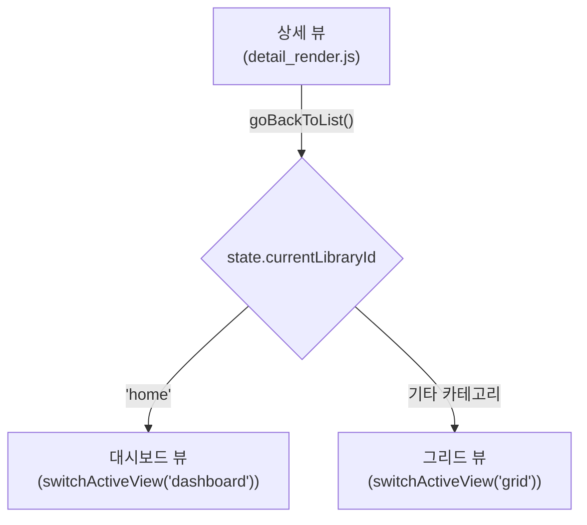
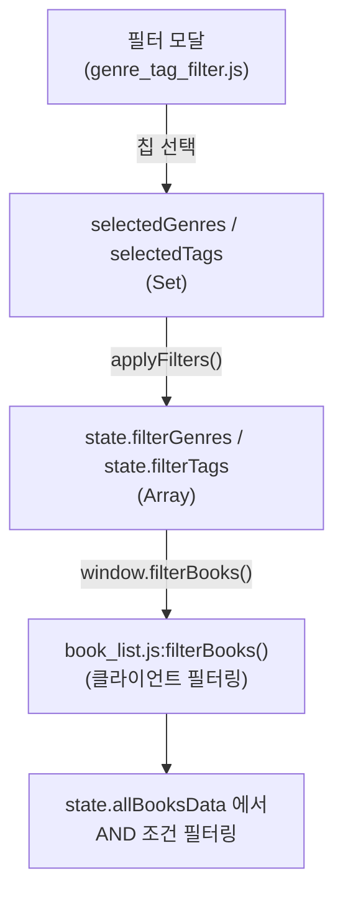

# 🔍 분석: 도서 상세 태그 클릭 → 태그 필터 검색 기능

## 현재 상태 분석

### 1. 이미 구현된 부분 (부분 완성)

[detail_render.js:13-25](file:///c:/project/media_server/static/js/detail_render.js#L13-L25)에 **태그/장르 클릭 이벤트가 이미 바인딩**되어 있습니다:

```javascript
// 장르 칩 (파란색) - 17번 줄
onclick="goBackToList(); window.selectGenreFilter('판타지')"

// 태그 칩 (초록색) - 24번 줄  
onclick="goBackToList(); window.selectTagFilter('이세계')"
```

### 2. 끊어진 부분 (미완성)

| 함수 | 정의 여부 | 상태 |
|---|---|---|
| `goBackToList()` | ✅ [modal.js:153](file:///c:/project/media_server/static/js/modal.js#L153) | 정상 동작 |
| `window.selectGenreFilter()` | ❌ **미정의** | 클릭 시 `undefined is not a function` 에러 |
| `window.selectTagFilter()` | ❌ **미정의** | 클릭 시 `undefined is not a function` 에러 |

> [!CAUTION]
> `selectGenreFilter`와 `selectTagFilter` 함수가 **프로젝트 전체 어디에도 정의되어 있지 않습니다**. 현재 태그 클릭 시 콘솔에 에러가 발생하고 아무 동작도 하지 않습니다.

---

## 아키텍처 흐름 분석

### 현재 뷰 전환 흐름



### 현재 필터 시스템 흐름



### 핵심 제약 사항

필터링은 **`state.allBooksData`에 로드된 도서 목록 기반 클라이언트 필터링**입니다:
- [book_list.js:184-200](file:///c:/project/media_server/static/js/book_list.js#L184-L200) - 장르/태그 AND 필터 로직
- `state.allBooksData`가 비어있으면 (예: 홈 대시보드 → 그리드 전환) 필터가 작동하지 않음
- 특정 카테고리의 도서 목록이 로드된 상태에서만 필터링 가능

---

## 구현 방안 (2가지 선택지)

### 방안 A: 현재 카테고리 그리드 뷰 내 필터 적용 (권장)

태그 클릭 시 **상세 뷰를 닫고 → 현재 카테고리의 그리드 뷰로 복귀 → 해당 태그/장르 필터 자동 적용**.

**수정 대상 파일:**

| 파일 | 변경 내용 |
|---|---|
| [genre_tag_filter.js](file:///c:/project/media_server/static/js/genre_tag_filter.js) | `selectGenreFilter()`, `selectTagFilter()` 함수 정의 + `window` 바인딩 |
| [tab_media_library.js](file:///c:/project/media_server/static/js/tab_media_library.js) | 필요 시 카테고리 전환 로직 보조 |

**구현 로직:**

```javascript
// genre_tag_filter.js에 추가
export function selectGenreFilter(genreName) {
    // 1. 기존 필터 초기화
    selectedGenres.clear();
    selectedTags.clear();
    
    // 2. 해당 장르만 선택
    selectedGenres.add(genreName);
    state.filterGenres = [genreName];
    state.filterTags = [];
    
    // 3. 현재 카테고리가 'home'이면 'all'로 전환하여 전체 도서 목록 로드
    if (state.currentLibraryId === 'home') {
        selectCategory('all');  // all 카테고리로 전환 → loadBooksList 트리거
        // loadBooksList 완료 후 filterBooks 호출 필요 (타이밍 문제)
    }
    
    // 4. 필터 적용
    renderChips();
    renderSelectedChips();
    filterBooks();
}

window.selectGenreFilter = selectGenreFilter;
window.selectTagFilter = selectTagFilter;
```

**장점:** 기존 필터 시스템 재활용, 구현 단순
**주의점:**
- `goBackToList()`가 먼저 실행되고 `selectGenreFilter()`가 비동기적으로 실행되므로 **실행 순서(타이밍) 이슈** 고려 필요
- `state.currentLibraryId === 'home'`인 경우 `goBackToList()`가 대시보드로 전환하는데, 대시보드에는 `filterBooks()`가 적용되지 않으므로 **카테고리를 `all`로 강제 전환** 필요
- `loadBooksList()`가 비동기이므로 데이터 로드 완료 후 `filterBooks()` 호출 시점 동기화 필요

---

### 방안 B: 홈 대시보드에 필터 결과 섹션 추가

대시보드 자체에 **서버 사이드 태그 검색 API**를 호출하여 검색 결과를 표시하는 새 섹션을 추가.

**수정 대상 파일:**

| 파일 | 변경 내용 |
|---|---|
| [genre_tag_filter.js](file:///c:/project/media_server/static/js/genre_tag_filter.js) | `selectGenreFilter()`, `selectTagFilter()` 함수 정의 |
| [dashboard.js](file:///c:/project/media_server/static/js/dashboard.js) | 태그 검색 결과 렌더링 섹션 추가 |
| 백엔드 API | 태그/장르 기반 도서 검색 API 신규 필요 |

**장점:** 대시보드에서 바로 결과 확인 가능, UX 우수
**단점:** 백엔드 API 신규 개발 필요, 대시보드 레이아웃 변경 필요, 구현 복잡도 높음

---

## 분석 결론

> [!IMPORTANT]
> **방안 A (그리드 뷰 필터 적용)를 권장합니다.** 기존 필터 시스템을 그대로 활용하므로 수정 범위가 작고, 핵심 로직은 `genre_tag_filter.js`에 2개 함수 추가 + `detail_render.js`의 onclick 호출 순서 조정만으로 완성할 수 있습니다.

### 구현 시 주요 고려사항

1. **타이밍 이슈**: `goBackToList()`와 `selectGenreFilter()`가 순차 실행이지만, `loadBooksList()`는 비동기이므로 데이터 로드 완료 콜백 또는 `setTimeout` 처리 필요
2. **카테고리 전환**: 홈 대시보드에서 상세 진입 후 태그 클릭 시, 대시보드가 아닌 `all` 카테고리 그리드로 전환해야 함
3. **필터 UI 동기화**: 필터 모달의 선택 상태(칩 하이라이트)도 태그 클릭 시 자동 동기화 필요
4. **기존 `onclick` 수정**: `detail_render.js`의 인라인 onclick을 `goBackToList()` + `selectGenreFilter()` 순차 호출에서 **하나의 래퍼 함수**로 묶는 것이 안전
