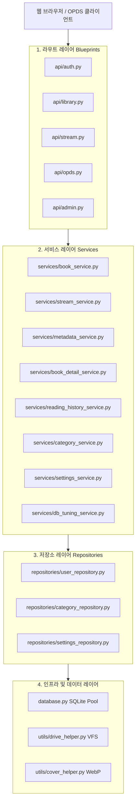
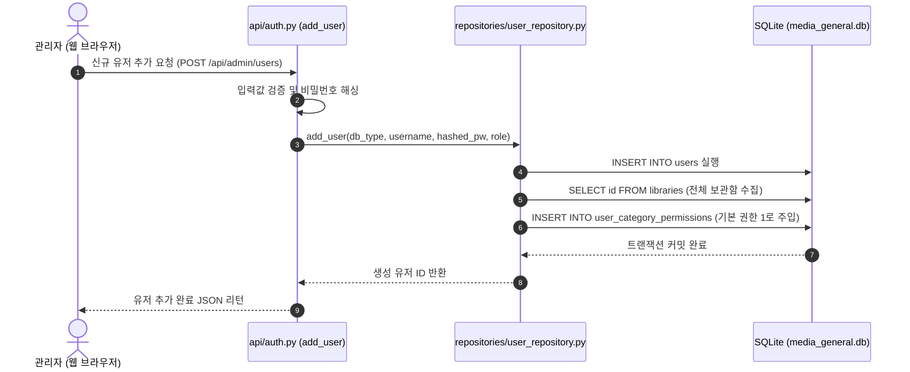

# 🏗️ BookOasis 아키텍처 및 레이어별 구성 가이드 (Architecture Guide)

이 문서는 BookOasis 미디어 서버의 아키텍처 설계와 각 소스코드 레이어별 역할, 핵심 클래스 및 함수, 그리고 데이터 흐름에 대해 상세히 기술합니다.

---

## 1. 아키텍처 개요 (Architecture Overview)

BookOasis는 관심사의 분리(SoC)를 극대화하기 위해 **4계층 아키텍처(Layered Architecture)**를 채택하고 있습니다. 

* **라우터(Controller)** 레이어는 요청 진입 및 검증을 처리합니다.
* **서비스(Service)** 레이어는 풍부한 도메인 비즈니스 논리를 실행합니다.
* **저장소(Repository)** 레이어는 데이터베이스로의 직접적인 질의(SQL) 처리를 캡슐화합니다.
* **데이터(Infrastructure)** 레이어는 물리적 데이터베이스 세션과 드라이브 마운트 등을 통제합니다.

---

## 2. 레이어별 상세 설명 (Layer Details)

### 📌 1) 라우트 레이어 (Route Layer)
클라이언트의 HTTP 요청을 수신하고 파라미터를 검증하여 적절한 서비스(Service) 메서드를 트리거하는 관문 역할을 합니다. `api/` 및 `api/routes/` 디렉토리에 분리 설계되어 있습니다.
* **`api/auth.py` (인증 관리)**: 로그인 처리, 비밀번호 변경, 사용자 계정 생성 및 삭제 흐름을 통제합니다.
* **`api/routes/library_routes.py` (라이브러리 제어)**: 라이브러리 추가, 메타 수정, 스케줄링 설정 등 어드민 관련 제어를 담당합니다.
* **`api/routes/system_routes.py` (시스템 라우터)**: 웹 페이지 인덱스(`/`) 렌더링, `/health` 헬스체크 API 응답을 반환합니다.

### 📌 2) 서비스 레이어 (Service Layer)
도메인의 실질적인 비즈니스 로직 및 업무 흐름 조율이 집중된 순수 파이썬(Plain Python) 모듈 레이어입니다.
* **`services/db_tuning_service.py` (`db_tuning_service`)**: SQLite 물리 파일 조각 모음(`VACUUM`), 데이터 통계 갱신(`ANALYZE`), 인덱스 구조 재빌드(`REINDEX`)를 제어하는 시스템 튜닝 전담 서비스입니다.
* **`services/settings_service.py` (`SettingsService`)**: 시스템 설정값을 가져오거나 양쪽 데이터베이스(`general`, `adult`)에 동기화하여 쓰는 비즈니스 논리를 담당합니다.
* **`services/category_service.py` (`CategoryService`)**: 보관함 카테고리 추가 및 수정, 권한별 목록 반환을 조율합니다.

### 📌 3) 저장소 레이어 (Repository Layer)
데이터베이스의 테이블 질의(SQL) 구문을 전담 격리하여 계층 결합도를 낮추는 레이어입니다. `repositories/` 디렉토리에 수록되어 있습니다.
* **`repositories/user_repository.py` (`UserRepository`)**: `users` 및 `user_category_permissions` 테이블에 관한 모든 CRUD SQL 쿼리를 은닉합니다.
* **`repositories/category_repository.py` (`CategoryRepository`)**: `libraries` 테이블의 데이터 입출력과 크론 주기 정보 업데이트 SQL 쿼리를 전담합니다.
* **`repositories/settings_repository.py` (`SettingsRepository`)**: `settings` 테이블의 설정값을 읽고 쓰는 SQL 연산을 전담합니다.

---

## 3. 핵심 시퀀스 데이터 흐름 (Core Data Flow)

### 🔄 회원 추가 및 모든 카테고리 권한 시딩 데이터 흐름

