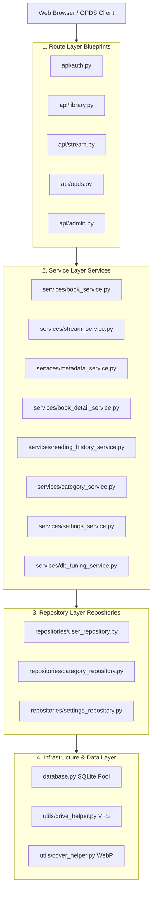
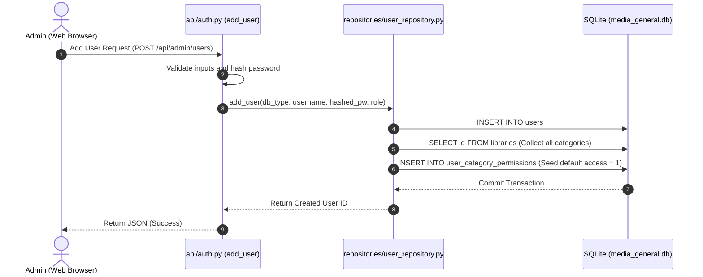

# 🏗️ BookOasis Architecture and Layered Structure Guide (Architecture Guide)

This document describes the architectural design of the BookOasis media server, the roles of each source code layer, key classes and functions, and the flow of data in detail.

---

## 1. Architecture Overview

BookOasis adopts a **4-tier layered architecture (Layered Architecture)** to maximize the separation of concerns (SoC).

* The **Route (Controller)** layer handles incoming requests and parameters validation.
* The **Service** layer executes rich domain business logic.
* The **Repository** layer encapsulates direct query (SQL) processing to the database.
* The **Data (Infrastructure)** layer controls physical database sessions and drive mounts.

---

## 2. Layer Details

### 📌 1) Route Layer
Receives HTTP requests from clients, validates parameters, and triggers appropriate service methods. It is separated into the `api/` and `api/routes/` directories.
* **`api/auth.py` (Authentication)**: Controls login processing, password changes, and user account creation and deletion.
* **`api/routes/library_routes.py` (Library Control)**: Handles administrator controls such as library creation, metadata modification, and scheduling settings.
* **`api/routes/system_routes.py` (System Router)**: Renders the web page index (`/`) and returns `/health` check API responses.

### 📌 2) Service Layer
A layer of pure Python modules where actual domain business logic and workflow coordination are concentrated.
* **`services/db_tuning_service.py` (`db_tuning_service`)**: A system tuning service that manages SQLite physical defragmentation (`VACUUM`), updates database statistics (`ANALYZE`), and rebuilds index structures (`REINDEX`).
* **`services/settings_service.py` (`SettingsService`)**: Handles the business logic for retrieving setting values and writing/syncing them to both databases (`general` and `adult`).
* **`services/category_service.py` (`CategoryService`)**: Coordinates adding/editing categories and returning category lists filtered by user permissions.

### 📌 3) Repository Layer
A layer that isolates SQL query statements to lower the architectural coupling. Located in the `repositories/` directory.
* **`repositories/user_repository.py` (`UserRepository`)**: Encapsulates all CRUD SQL queries for the `users` and `user_category_permissions` tables.
* **`repositories/category_repository.py` (`CategoryRepository`)**: Manages SQL operations for the `libraries` table, including category CRUD and cron schedule updates.
* **`repositories/settings_repository.py` (`SettingsRepository`)**: Handles SQL queries to read and write values in the `settings` table.

---

## 3. Core Data Flow

### 🔄 User Creation and Permission Seeding Flow

