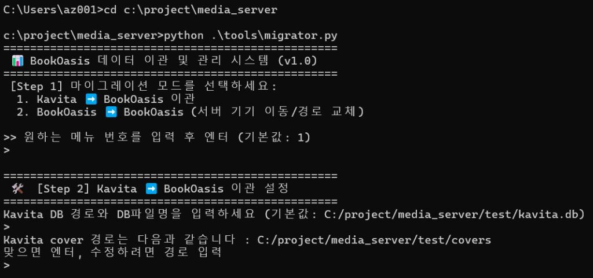
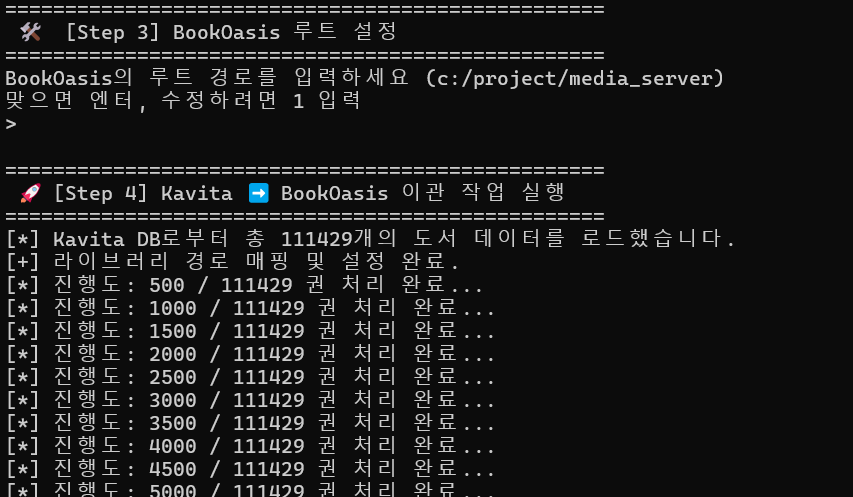
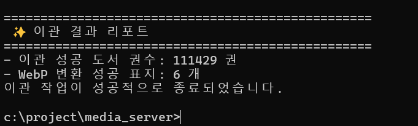

# 🚀 Kavita ➡️ BookOasis Perfect Migration Guide

> **Welcome to BookOasis - lighter, faster, and offering a premium responsive web viewer experience!**  
> This guide explains how to migrate tens of thousands of **books metadata, custom covers (with high-quality WebP auto-conversion), and reading progress** from your existing Kavita instance to BookOasis in under a minute.

---

## 💡 Why migrate to BookOasis?

| Comparison Item | 🐘 Kavita | ⚡ BookOasis (Recommended) |
| :--- | :--- | :--- |
| **Backend Resources** | High memory baseline due to .NET VM execution. | Minimal memory footprint using ultra-light Python Flask. |
| **Database Performance** | SQL sluggishness above 100k books due to heavy multi-table joins. | Blazing fast single SELECT queries with flat schema structure. |
| **Concurrency Control** | Web UI freezing during active folder scanning. | Non-blocking web response using **DB WAL mode** & **50ms throttling**. |
| **Cover Optimization** | Large raw JPG/PNG covers waste storage. | **Auto WebP transcoding** preserves quality with up to 70% storage savings. |
| **Path Flexibility** | Moving root folder breaks all custom covers. | Robust interactive CLI helper supports bulk path replacements. |

---

## 🛠️ Prerequisites

To run the interactive migrator tool, install dependencies in your project directory:
```bash
pip install -r mig_requestment.txt
```

---

## 📖 Step-by-Step Migration Guide

### Step 1 & 2: Mode Selection and Kavita Database Configuration
Launch the interactive CLI by running the command in your terminal:
```bash
python ./tools/migrator.py
```



1. **[Step 1]** Select the migration mode. Enter **`1`** (Kavita ➡️ BookOasis Migration) and press Enter.
2. **[Step 2]** Enter the path to your source Kavita database file (`kavita.db`). (Press Enter to accept the default path if provided.)
3. Confirm the path to Kavita's cover directories. Adjust if necessary, or press Enter to continue.

---

### Step 3 & 4: Target BookOasis Configuration & Execution
Specify the destination paths for the BookOasis server and start the real-time migration process.



1. **[Step 3]** Confirm the target BookOasis root directory and press Enter.
2. **[Step 4]** The migration process will start immediately. Even database sizes exceeding **110,000 books** will migrate instantly with a real-time progress bar.
   > 💡 During this process, metadata such as **Author, Publisher, Release Date, Genre, Tags, and Summary** will be parsed and mapped to the BookOasis DB schema.
   > Simultaneously, existing raw cover images are detected, optimized, and **converted into high-compression WebP format** on the fly.

---

### Step 5: Completion Report
Once the migration process successfully finishes, a summary report will be printed out:



* **Successfully Migrated Books**: 111,429 books
* **WebP Transcoded Covers**: Visualized counts of optimized cover conversions.

Now, open your BookOasis web dashboard. You will see all your reading progress, custom metadata, and covers running under a blazing-fast media server environment!
