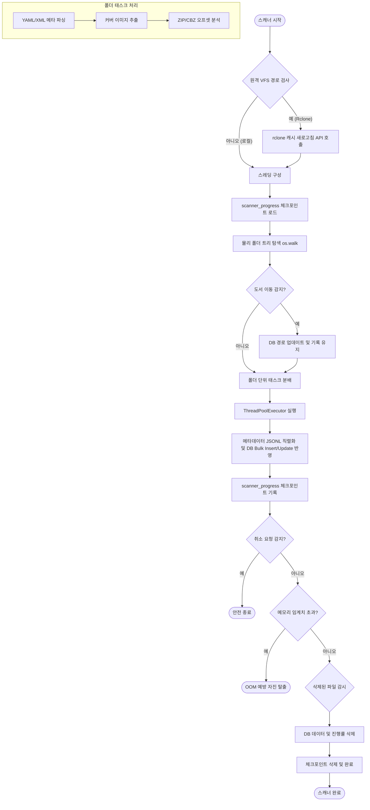

# 📑 북 오아시스 스캐너 스캔 로직 기술 사양서 (Scanner Logic Specification)

이 문서는 북 오아시스(BookOasis) 미디어 서버의 스캐너 및 파일 시스템 동기화 시스템의 핵심 동작 메커니즘을 상세히 설명합니다.

---

## 1. 스캐너 전체 동작 흐름

스캐너는 데이터베이스(`media_general.db`, `media_adult.db`)의 라이브러리 설정을 순회하며, 파일 시스템의 실제 상태와 DB 데이터를 일치시키는 동기화 엔진입니다.

---

## 2. 핵심 기능별 세부 메커니즘

### ① 원격 VFS(Rclone) 연동 및 캐시 새로고침
* **대상 판별**: 물리 경로가 원격 마운트 경로인지 판별합니다 (`is_remote_path`).
* **동작 방식**: 
  - 라이브러리 설정에서 `vfs_refresh_before_scan`이 `1`로 켜져 있다면, 스캔 시작 직전에 rclone의 Remote Control API(`http://localhost:5572/vfs/refresh`)를 호출합니다.
  - 이때 전체 경로를 새로고침하는 대신, API 요청 Body에 **`{"dir": rel_path}`** 매개변수를 실어 호출함으로써 **해당 라이브러리의 상대 경로만 핀포인트로 새로고침**하여 원격 드라이브 갱신 성능을 극대화합니다.
  - 이를 통해 로컬 파일 시스템 레이어와 실제 원격 스토리지의 디렉터리 구조를 일치시킵니다.

### ② 스레딩 구성 및 네트워크 I/O 최적화
* **하이브리드 스레딩 모델**:
  - **로컬 경로**: I/O 효율성 극대화를 위해 최대 4개의 스레드(`MAX_SCANNER_THREADS = 4`)로 병렬 처리합니다.
  - **원격 마운트 경로**: 원격 드라이브 API 속도 제한(Rate Limit) 및 네트워크 부하를 예방하기 위해 단일 스레드로 직렬화하여 실행합니다.
  - **I/O 절약 정책**: 원격 드라이브에서는 무거운 압축 파일(`ZIP`/`CBZ`)의 파일 바이트 오프셋 분석을 생략하여 지연 시간을 크게 감소시킵니다.

### ③ 체크포인트 기반 스캔 상태 관리 및 취소 프로세스
* **체크포인트 아키텍처**:
  - `scanner_progress` 테이블을 활용하여 폴더 스캔이 성공할 때마다 데이터베이스에 완료 상태를 기록합니다.
  - 스캔이 도중에 취소되거나 OOM으로 중단된 후 재시작하면, 이미 완료된 폴더는 즉시 스킵하여 이어서 스캔이 진행됩니다.
  - 전체 라이브러리 스캔이 에러 없이 완전히 끝나면 해당 라이브러리의 체크포인트 데이터를 일괄 청소합니다.
* **실시간 조기 취소**:
  - 폴더 한 루프를 끝낼 때마다 DB의 `libraries.scan_status`를 읽어 `'cancelling'` 상태인지 판단하며, 감지 시 즉시 안전 종료합니다.

### ④ 도서 이동(Path 변경) 자동 감지 및 히스토리 보존
* **문제 해결**: 파일의 경로가 바뀌거나 상위 폴더 이름이 수정될 때 새 도서로 인식해 기존 독서 완료 내역과 통계가 날아가는 것을 방지합니다.
* **동작 방식**:
  - 사라진 파일 목록(`deleted_paths`)과 신규 발견 파일 목록(`new_paths`)을 교차 추출합니다.
  - 파일명(Basename)이 완벽히 일치하는 한 쌍이 존재하면, 이를 '도서 이동'으로 판단하여 `books.file_path` 값만 신규 경로로 `UPDATE` 처리합니다.
  - 이로써 고유 ID(`book_id`)와 여기에 바인딩된 독서 진행률(`user_progress`), 독서 기록(`user_reading_log`) 등이 유실 없이 완벽하게 복구 및 유지됩니다.

### ⑤ 메타데이터 파싱 및 병합 우선순위
* **소스**: `kavita.yaml` 및 `info.xml`
* **파싱 우선순위 및 규칙**:
  - `info.xml` (`parse_info_xml`): 제목, 시리즈, 작가, 출판사, 줄거리, 장르, 태그, 발행일을 추출합니다.
  - `kavita.yaml` (`parse_kavita_yaml`): 작가, 출판사, 외부 링크, 평점, 줄거리 및 파일별 커버 이미지 Base64 맵을 추출합니다.
  - 두 로컬 메타데이터 파일의 정보는 `merged_meta`로 병합되며, 중복되는 필드(예: 작가, 출판사, 줄거리 등)는 구조화된 데이터 파일 포맷 중 **XML(`info.xml`) 정보에 최우선 가중치를 부여**합니다.
  - 모든 텍스트 메타데이터는 HTML 태그 제거 및 특수 문자 엔티티 복원 가공을 거칩니다.

### ⑥ 단계별 표지 이미지 추출 및 매핑 전략
표지 이미지는 서버 자원 소모를 최소화하기 위해 아래 순서의 폴백(Fallback) 구조로 처리됩니다:

1. **YAML Base64 매핑**: `kavita.yaml` 내 `files` 노드에 개별 도서 파일명으로 맵핑된 Base64 데이터가 있다면, 이를 직접 디코딩하여 `covers/{library_id}` 디렉터리에 고유 MD5 해시 파일명으로 저장합니다.
2. **개별 도서 1:1 이미지 매칭**: 도서 파일과 동일 폴더 내에 확장자만 다른 파일(예: `[도서명].jpg`, `[도서명].png`, `[도서명].webp`)이 존재하는지 스캔하여 복사합니다.
3. **시리즈 대표 공통 커버 매칭**: 폴더 내에 대표 커버 파일(`cover.jpg`, `cover.png`, `folder.jpg`, `folder.png`)이 존재하는 경우 이를 시리즈 대표 표지로 복사해 사용합니다.
4. **파일 내부 첫 페이지 자동 추출 (원격 경로 아님 및 강제 스캔 시)**:
   - **EPUB**: `META-INF/container.xml` 및 Manifest의 cover 항목을 수색하여 원본 이미지를 다이렉트 추출합니다.
   - **ZIP / CBZ**: 압축 파일 내의 이미지 엔트리들을 자연 정렬(`natural_sort_key`)하여 가장 첫 번째 이미지 파일을 표지로 자동 압축 해제해 사용합니다.

### ⑦ 바이트 오프셋 메타데이터 분석 및 DB 저장
* **동작 원리**: 
  - `ZIP` / `CBZ` 파일 포맷을 대상으로 실행합니다.
  - 파일 전체의 압축을 미리 해제하지 않고, 내부에 포함된 개별 이미지 파일들의 바이트 오프셋(`local_header_offset`), 압축 크기, 파일 원래 크기, 압축 형식 정보를 수집합니다.
  - 수집된 데이터는 `book_offsets` 테이블에 대량 삽입(`executemany`)되며, `books.has_offsets = 1`로 상태를 플래그합니다.
  - 이 정보는 사용자가 책을 읽을 때 임의의 페이지로 즉각 점프하여 해당 부분의 바이트만 파일 채널로 긁어오는 **초고속 스트리밍 전송**의 필수 기반이 됩니다.

### ⑧ OOM(메모리 초과) 방지 자진 탈출 시스템
* **감시 매커니즘**:
  - 시스템 가용 RAM이 1.5GB 미만으로 떨어지거나, 현재 프로세스의 실제 메모리 점유(RSS)가 2.0GB를 초과할 경우 메모리 누수 및 시스템 크래시를 예방하기 위해 스캔을 일시 중단합니다.
  - 현재 완료한 폴더까지는 `scanner_progress`에 온전히 세이브한 뒤, 프로세스를 안전하게 종료(`sys.exit(0)`)합니다.
  - 시스템 데몬은 이 종료 신호를 수신해 메모리가 확보된 후 스캐너를 재가동하며, 이어서 스캔이 진행됩니다.

### ⑨ 실시간 삭제 감시 및 예외 장치
* **동작 원리**: 
  - 물리 파일 트리에 더 이상 나타나지 않는(삭제된) 도서 정보는 DB(`books`), 독서 진행도(`user_progress`), 독서 로그(`user_reading_log`) 테이블에서 트랜잭션 내에 일괄 격리 삭제됩니다.
* **비상 브레이크 안전장치**:
  - 만약 스캔 결과 찾은 물리 파일 개수가 **`0`개**인 경우, 실제로 사용자가 모든 파일을 지웠다기보다는 마운트 네트워크 드라이브가 갑자기 해제되었거나 디스크 경로 오류일 확률이 극도로 높습니다.
  - 이 경우 삭제 로직이 작동하여 DB 전체가 밀리는 대참사를 예방하기 위해, **모든 삭제 프로세스를 강제 취소**하고 경고 로그와 함께 즉시 세션을 빠져나옵니다.

### ⑩ ZIP/CBZ 압축 파일 처리 및 부분 바이트 스트리밍 상세 전략
* **압축 내 파일 정렬 정책**:
  - ZIP/CBZ 포맷 파일 스캔 시 아카이브 내부의 이미지 파일들(`.jpg`, `.jpeg`, `.png`, `.gif`, `.webp`, `.bmp`)을 필터링하여 수집합니다.
  - 수집된 이미지 파일들은 사람이 직관적으로 느끼는 파일 정렬 순서와 일치하도록 **`natural_sort_key`를 사용해 자연 정렬**을 실행합니다. (예: `page_2.jpg`가 `page_10.jpg`보다 항상 앞에 위치하도록 보장)
* **부분 바이트 스트리밍을 위한 오프셋 수집**:
  - 파일 전체의 압축을 서버 디렉터리에 미리 풀어놓는 전통적인 방식 대신, ZIP 아카이브 구조 내부의 개별 파일 정보가 가리키는 **로컬 헤더 물리 바이트 시작점(`local_header_offset`)**, **압축 크기(`compress_size`)**, **무압축 크기(`file_size`)**, **압축 형태(`compress_type`)**를 파싱하여 `book_offsets` 테이블에 보존합니다.
  - 사용자가 특정 페이지의 이미지를 호출하면, 서버는 해당 페이지의 오프셋 범위를 DB에서 조회하여 **`f.seek()`를 통해 물리 파일의 해당 범위 바이트 영역만 즉시 읽어서 디스크 I/O 및 CPU 압축 해제 오버헤드를 극적으로 최소화**하여 전송하는 초고속 실시간 스트리밍 뷰어를 구현합니다.
* **표지 Fallback 자동 추출**:
  - 개별 책 1:1 이미지나 폴더 내 대표 표지 이미지 파일이 없을 경우, 자연 정렬된 아카이브 이미지 파일 목록에서 **첫 번째 이미지(0번 인덱스) 파일**을 표지 이미지 파일로 물리 추출하여 `covers/{library_id}` 하위에 해시 파일명으로 자동 생성합니다.
* **VFS(원격 네트워크 드라이브) 환경 예외 규정**:
  - 원격 클라우드 저장소(구글 드라이브 등)가 Rclone VFS로 마운트된 상태에서는 네트워크 환경 특성상 대용량 ZIP 파일 내부 헤더를 탐색하기 위해 수많은 Read/Seek을 가할 경우 심각한 응답 지연(API 병목) 및 스캐너 프리징 현상이 발생합니다.
  - 이를 예방하기 위해 **물리 경로가 원격 마운트 환경(`is_remote`가 참인 경우)으로 판별되면 ZIP/CBZ 압축 파일 내부 탐색(오프셋 색인 및 표지 자동 추출) 동작을 강제로 스킵(Skip)하도록 예외 처리**되어 있습니다.

### ⑪ JSONL 기반 고속 벌크 처리 및 병목 현상 해소
* **문제 해결**: 기존에는 개별 워커 스레드가 파일 단위로 매번 DB 트랜잭션을 일으켜, 스캔 중 UI 대시보드가 멈추거나 DB 락(Lock) 현상이 빈번하게 발생했습니다.
* **동작 방식**:
  - 스레드들은 DB에 직접 연결하지 않고, 파싱된 도서 데이터와 메타데이터를 파일시스템의 임시 **`.jsonl` 파일에 라인 단위로 즉각 직렬화(Serialize)하여 기록**합니다.
  - 모든 스레드의 탐색 작업이 종료된 후, 메인 스캔 엔진(`engine.py`)이 `.jsonl` 파일을 한 번에 읽어들여 단일 트랜잭션으로 **Bulk Insert 및 Update**를 수행합니다.
  - 이를 통해 스캔 시퀀스의 성능과 안정성이 비약적으로 향상되며, 대규모 스캔 중에도 사용자가 쾌적하게 웹 대시보드를 사용할 수 있습니다.

### ⑫ mtime 기반의 초고속 스킵(Ultra-fast Skip) 알고리즘
* **문제 해결**: 이미 완벽하게 DB에 등록된 도서나 폴더를 무의미하게 재스캔하며 파서를 가동해 I/O와 CPU 자원을 소모하던 문제를 획기적으로 개선했습니다.
* **동작 방식**:
  - 특정 폴더 진입 시 해당 폴더의 내용물을 읽고, 파일들이 이미 DB 캐시 맵(`db_meta_full`, `db_offsets_cached`)에 모두 100% 등록되어 있는지 확인합니다.
  - 폴더의 최근 수정 시간(`mtime`)을 확인하여 외부 메타데이터 파일(`kavita.yaml`, `info.xml` 등)의 신규 추가나 변경 내역이 없고, 모든 압축 파일이 등록 완료 상태라면 **가장 무거운 파서(Parser) 로직 자체를 호출하지 않고 해당 폴더 전체를 0.001초 만에 즉시 스킵(Return)**해 버립니다.
  - 이 초고속 스킵 기능 덕분에 대용량 라이브러리의 반복적인 주기적 동기화 작업 시 시스템 부하를 제로(0)에 가깝게 억제할 수 있습니다.
