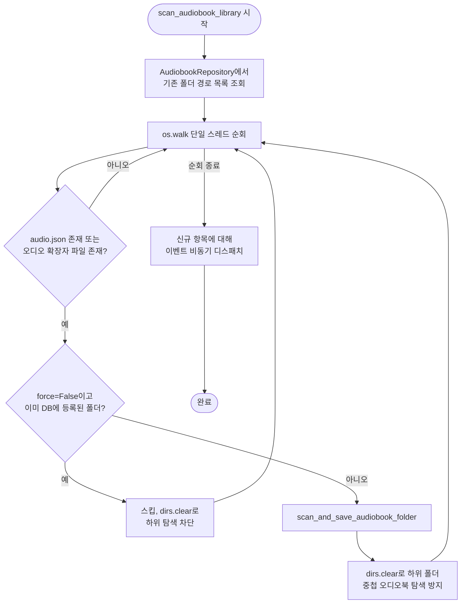

# 📑 북 오아시스 스캐너 스캔 로직 기술 사양서 (Scanner Logic Specification)

이 문서는 북 오아시스(BookOasis) 미디어 서버의 스캐너 및 파일 시스템 동기화 시스템의 핵심 동작 메커니즘을 상세히 설명합니다.

일반(만화/전자책) 스캐너와 오디오북 스캐너는 완전히 분리된 별도 파이프라인입니다. 1~2장은 일반 스캐너를, 3장은 오디오북 스캐너를 다룹니다. 로컬 메타데이터 파서(`kavita.yaml`, `komga.yaml` 등)를 직접 추가/수정하려면 [guide_scanner_parser.md](./guide_scanner_parser.md)를, 스캔 완료 웹훅/플러그인 훅을 활용하려면 [guide_plugins.md](./guide_plugins.md)를 함께 참고하세요.

---

## 1. 스캐너 전체 동작 흐름 (일반/성인 라이브러리)

스캐너는 데이터베이스(`media_general.db`, `media_adult.db`)의 라이브러리 설정을 순회하며, 파일 시스템의 실제 상태와 DB 데이터를 일치시키는 동기화 엔진입니다. `db_type`이 `audiobook`인 경우 이 흐름을 전혀 타지 않고 [3장 오디오북 스캐너](#3-오디오북-스캐너-완전히-분리된-파이프라인)로 즉시 위임됩니다.

```mermaid
graph TD
    Start([스캐너 시작 tools/scanner/core.py]) --> GDriveCheck{구글드라이브 웹링크?}
    GDriveCheck -- "예" --> SkipWakeup[로컬 Wake-up 검사 우회]
    GDriveCheck -- "아니오" --> Wakeup[HDD/NAS Wake-up 재시도<br/>최대 3~6회, 실패 시 예외]
    Wakeup --> VFS_Check{원격 VFS 경로 검사}
    SkipWakeup --> VFS_Check
    VFS_Check -- "예 (Rclone)" --> VFS_Refresh[rclone 캐시 새로고침 API 호출]
    VFS_Check -- "아니오 (로컬)" --> AudiobookCheck
    VFS_Refresh --> AudiobookCheck{db_type == audiobook?}

    AudiobookCheck -- "예" --> AudiobookPipeline[오디오북 전용 파이프라인으로 위임<br/>3장 참고, 여기서 return]
    AudiobookCheck -- "아니오" --> SelfHeal[사전 DB 무결성 점검<br/>PRAGMA integrity_check, 손상 시 db_recovery.py 자동실행]

    SelfHeal --> Thread_Config[스레딩 구성: 로컬 4 / 원격 1]
    Thread_Config --> Load_Checkpoint[scanner_progress 체크포인트 로드]
    Load_Checkpoint --> Walk_Dirs{경로 유형}
    Walk_Dirs -- "일반 폴더" --> Walk_Local[os.walk 물리 탐색]
    Walk_Dirs -- "GDrive 웹공유링크" --> Walk_GDrive[fetch_gdrive_folder_files로<br/>가상 gdrive:// 경로 구성]

    Walk_Local --> Ignore_Filter{IgnoreFilter 스캔 예외 필터}
    Ignore_Filter -- "예외 디렉토리" --> Prune_Dirs[dirs[:] in-place 제거 및 하위 탐색 차단]
    Ignore_Filter -- "일반 디렉토리" --> Task_Collect[폴더 단위 태스크 수집]
    Prune_Dirs --> Task_Collect
    Walk_GDrive --> Task_Collect

    Task_Collect --> Move_Detect{도서 이동/개명 감지?<br/>basename 매칭}
    Move_Detect -- "예" --> Update_Path[DB 경로 UPDATE, book_id/독서기록 유지]
    Move_Detect -- "아니오" --> Task_Distribute[ThreadPoolExecutor 실행]
    Update_Path --> Task_Distribute

    subgraph "폴더 태스크 처리 tools/scanner/tasks.py"
        FileSkip{파일별 mtime+size<br/>캐시 일치?} -- "예" --> FastSkip[초고속 스킵]
        FileSkip -- "아니오" --> Parse_Meta[플러그인 메타 파서 자동 로드<br/>병합 + ComicInfo.xml 폴백]
        Parse_Meta --> Extract_Cover[표지 추출 4단계 폴백]
        Extract_Cover --> Parse_Offset[ZIP/CBZ 오프셋 분석 또는<br/>Offset-only 고속 경로]
    end

    Task_Distribute --> FileSkip

    Parse_Offset --> Pending[메모리 pending_inserts/updates 누적]
    FastSkip --> Pending
    Pending --> FlushTrigger{하이브리드 flush 트리거<br/>변경 100건 또는 폴더 50개}
    FlushTrigger -- "충족" --> RedisLock[Redis 분산락 획득 후<br/>DB Bulk 반영 + scanner_progress 기록]
    FlushTrigger -- "미충족" --> Cancel_Check
    RedisLock --> JSONL_Log[커밋 성공분을 .jsonl 감사로그로 append]
    JSONL_Log --> Cancel_Check{3폴더마다 취소 요청 감지?<br/>libraries.scan_status +<br/>scanner_tasks 이중 확인}

    Cancel_Check -- "예" --> Terminate_Safe([안전 종료: 상태를 ready로 되돌리고 반환])
    Cancel_Check -- "아니오" --> Memory_Check{메모리 임계치 초과?<br/>DB 설정값 기준}

    Memory_Check -- "예" --> Terminate_OOM[os.execv로 scanner_worker.py<br/>자체 프로세스 재실행 후 이어서 진행]
    Memory_Check -- "아니오" --> More_Folders{남은 폴더 존재?}
    More_Folders -- "예" --> Task_Distribute
    More_Folders -- "아니오" --> Final_Flush[최종 flush 및 JSONL 정리]

    Final_Flush --> Remove_Check[삭제된 파일 감시: soft-delete +<br/>7일 경과분 hard-delete]
    Remove_Check --> Clear_Checkpoint[scanner_progress 삭제, scan_status=ready]
    Clear_Checkpoint --> Event_Dispatch[신규 도서 이벤트 비동기 디스패치<br/>scan.new_books_detected + book.new + 플러그인 훅]
    Event_Dispatch --> End([스캐너 완료])
```

---

## 2. 핵심 기능별 세부 메커니즘 (일반/성인 스캐너)

### ① HDD/NAS Wake-up 및 사전 경로 검증
* **문제 해결**: 절전 상태의 물리 HDD나 응답이 느린 NAS/네트워크 마운트가 스캔 시작 직후 `FileNotFoundError`를 일으켜 스캔이 실패하는 것을 방지합니다.
* **동작 방식** (`tools/scanner/core.py::scan_library`):
  - 구글 드라이브 웹 공유 링크 대상 경로는 로컬 디스크가 아니므로 Wake-up 검사를 건너뜁니다.
  - 그 외 경로는 `os.path.exists()`를 반복 호출해 스핀업/네트워크 세션 연결을 유도합니다. 기본은 최대 3회(1.0초 간격), 라이브러리별 DB 설정 `HDD_AGGRESSIVE_WARMUP=1`이 켜져 있고 원격 경로가 아니면 최대 6회(3.0초 간격)의 "적극 웜업" 모드로 전환됩니다.
  - 적극 웜업 모드에서는 대상 폴더 상위 20개 항목과 첫 하위 폴더의 10개 항목까지 `os.scandir` + `stat()`으로 강제 접근해 디스크/캐시를 예열합니다.
  - 모든 시도 후에도 접근 불가능한 경로가 있으면 `FileNotFoundError`를 던져 스캔 자체를 중단시킵니다(오탐 삭제 방지).

### ② 원격 VFS(Rclone) 연동 및 캐시 새로고침
* **대상 판별**: 라이브러리 DB 레코드의 `is_remote=1` 여부와 `vfs_refresh_before_scan=1` 설정을 함께 확인합니다 (`tools/scanner/vfs.py::trigger_vfs_refresh`).
* **동작 방식**:
  - 대상 상대경로 후보 목록(`get_rclone_refresh_dirs`)을 순서대로 시도하며, 여러 RC URL(`RCLONE_RC_URL`에 콤마로 다중 등록 가능)에 대해서도 순회합니다.
  - 전체 경로를 새로고침하는 대신, API 요청 Body에 **`{"dir": rel_path}`** 매개변수를 실어 호출함으로써 **해당 라이브러리의 상대 경로만 핀포인트로 새로고침**하여 원격 드라이브 갱신 성능을 극대화합니다.
  - 응답 본문을 파싱해 `"file does not exist"` 같은 실패 응답은 성공으로 오인하지 않도록 검증(`_is_vfs_refresh_success_response`)하고, RC 서버가 아직 기동 중이라 연결이 거부된 경우(`Connection refused`) 최대 3회까지 2초 간격으로 재시도합니다.
  - 모든 요청에는 엔진 시그니처가 담긴 `User-Agent` 헤더가 첨부되어, 이 로직이 복제/재사용되더라도 네트워크 트래픽에서 출처를 식별할 수 있습니다.

### ③ 사전 DB 무결성 자가 점검 (Self-Healing)
* **동작 방식** (`tools/scanner/core.py::_run_db_self_recovery`):
  - SQLite 모드에서 스캔 직전 `PRAGMA integrity_check;`를 실행합니다.
  - 결과가 `'ok'`가 아니거나 DB 접근 중 손상 예외가 발생하면, `tools/db_recovery.py --db <path> --yes`를 서브프로세스로 자동 실행해 무인 복구를 시도합니다(최대 300초 대기).
  - MariaDB/MySQL 엔진(`DB_ENGINE`/`DBMS` 환경변수)에서는 이 점검을 건너뜁니다.
  - 점검 자체가 실패해도 스캔은 계속 진행됩니다(경고 로그만 남김).

### ④ 스레딩 구성 및 네트워크 I/O 최적화
* **하이브리드 스레딩 모델**:
  - **로컬 경로**: I/O 효율성 극대화를 위해 최대 4개의 스레드(`MAX_SCANNER_THREADS = 4`)로 병렬 처리합니다.
  - **원격 마운트 경로**: 원격 드라이브 API 속도 제한(Rate Limit) 및 네트워크 부하를 예방하기 위해 단일 스레드로 직렬화하여 실행합니다.
  - **I/O 절약 정책**: 원격 드라이브에서는 무거운 압축 파일(`ZIP`/`CBZ`)의 파일 바이트 오프셋 분석을 생략하여 지연 시간을 크게 감소시킵니다.
  - 이 하이브리드 모델은 오디오북 스캐너에는 적용되지 않습니다 — 오디오북은 항상 단일 스레드로 순차 처리됩니다([3장](#3-오디오북-스캐너-완전히-분리된-파이프라인) 참고).

### ⑤ 체크포인트 기반 스캔 상태 관리 및 취소 프로세스
* **체크포인트 아키텍처**:
  - `scanner_progress` 테이블을 활용하여 폴더 스캔이 성공할 때마다 데이터베이스에 완료 상태를 기록합니다.
  - 스캔이 도중에 취소되거나 OOM으로 중단된 후 재시작하면, 이미 완료된 폴더는 즉시 스킵하여 이어서 스캔이 진행됩니다.
  - 전체 라이브러리 스캔이 에러 없이 완전히 끝나면 해당 라이브러리의 체크포인트 데이터를 일괄 청소합니다.
* **실시간 조기 취소** (`tools/scanner/engine.py`):
  - 완료된 폴더 3개마다(매 폴더가 아님) 취소 여부를 확인합니다. 이때 스캔에 사용 중인 커넥션이 아닌 **별도의 독립 커넥션**으로 조회하는데, 이는 장기 커넥션이 WAL 스냅샷 격리로 인해 다른 세션의 COMMIT(취소 요청)을 즉시 읽지 못하는 문제를 회피하기 위함입니다.
  - 취소 신호는 두 소스를 모두 확인합니다: `libraries.scan_status = 'cancelling'` 그리고 `scanner_tasks` 테이블의 `task_key = library_scan_{db_type}_{library_id}` 행이 `status = 'cancelled'`인 경우.
  - 취소가 감지되면 남은 pending 데이터를 최종 flush한 뒤 `libraries.scan_status`를 `'ready'`로 되돌리고 즉시 반환합니다(체크포인트는 남겨두어 다음 스캔에서 이어서 진행).
  - 오디오북 스캐너에는 체크포인트/취소 로직이 전혀 없습니다 — 재시작 시 `skip_existing` 정책으로만 중복 작업을 줄입니다.

### ⑥ 스캔 예외 필터링 (IgnoreFilter & .bookoasisignore)
* **동작 원리**:
  - `tools/scanner/ignore_filter.py` 모듈이 전역 DB 설정(`SCAN_IGNORE_PATTERNS`) 및 폴더별 `.bookoasisignore` 파티션 파일을 실시간으로 처리합니다.
  - 끝에 `/`가 붙은 패턴(예: `@eaDir/`, `#recycle/`, `.git/`, `.svn/`)은 **디렉토리 전용 와일드카드**로 인식되며, `os.walk()` 시 `dirs[:] = [d for d in dirs if d not in ignored]` 방식으로 in-place 제거하여 하위 디렉토리 트리의 물리적 탐색을 사전에 완전 차단합니다.
  - 파일 와일드카드 패턴(예: `*.tmp`, `*.sample.cbz`, `Thumbs.db`)은 파일 목록 순회 시 무시 처리되며, 무시된 디렉토리/파일은 `[Scanner-Ignore]` 명칭으로 로그에 기록됩니다.
  - 구글 드라이브 웹링크 스캔 경로에서도 동일한 필터가 상대 폴더/파일명 기준으로 적용됩니다.

### ⑦ 도서 이동(Path 변경) 자동 감지 및 히스토리 보존
* **문제 해결**: 파일의 경로가 바뀌거나 상위 폴더 이름이 수정될 때 새 도서로 인식해 기존 독서 완료 내역과 통계가 날아가는 것을 방지합니다.
* **동작 방식** (`tools/scanner/sync_detector.py::detect_and_handle_book_movement`):
  - 사라진 파일 목록(`deleted_paths`)과 신규 발견 파일 목록(`new_paths`)을 교차 추출하기 전에, 윈도우/리눅스 경로 구분자 차이(`\` ↔ `/`)를 통일하는 정규화를 먼저 적용합니다.
  - 파일명(Basename)이 완벽히 일치하는 한 쌍이 존재하면, 이를 '도서 이동'으로 판단하여 `books.file_path` 값만 신규 경로로 `UPDATE` 처리합니다.
  - IMGDIR 가상 항목(`__folder__.imgdir`, [⑫](#-imgdir-가상-북-단위-이미지-폴더) 참고)은 파일명이 항상 동일하므로 오탐을 막기 위해 이 basename 매칭에서 명시적으로 제외됩니다.
  - 이로써 고유 ID(`book_id`)와 여기에 바인딩된 독서 진행률(`user_progress`), 독서 기록(`user_reading_log`) 등이 유실 없이 완벽하게 복구 및 유지됩니다.

### ⑧ 메타데이터 파싱 및 병합: 플러그인 확장형 파서 로더
* **아키텍처**: 과거의 `info.xml`/`kavita.yaml` 2종 하드코딩 병합에서, `tools/scanner/metadata/` 폴더를 스캔해 `TARGET_FILENAME`과 `parse()`를 갖춘 모든 `*.py` 모듈을 자동으로 로드·병합하는 **동적 플러그인 로더**(`tools/scanner/metadata/__init__.py::load_all_parsers`)로 전환되었습니다.
  - 커뮤니티 기여자는 `komga_yaml.py` 같은 자급형(self-contained) 모듈 하나만 추가하면, 해당 폴더에 대상 파일(`komga.yaml`)이 있을 때 자동으로 발견·병합됩니다. 새 파서 작성 규칙은 [guide_scanner_parser.md](./guide_scanner_parser.md)에 정리되어 있습니다.
  - 현재 기본 내장 파서: `audio_json.py`, `comicinfo_xml.py`(폴더 병합에서는 제외, 파일별 경로에서 별도 사용), `info_xml.py`, `kavita_yaml.py`, `series_json.py`(웹툰용 `series.json`, 원격 표지 URL 지원).
  - **병합 규칙**: 파일명 알파벳 순으로 로드되며, 텍스트 필드는 "첫 값 우선(first writer wins)" 방식으로 병합됩니다. `genre`/`tags`는 콤마 분리 후 정규화·중복 제거되어 합쳐지고, `cover_b64_map`은 딕셔너리 병합(update)되며, `is_webtoon`/`has_yaml`은 OR 결합됩니다. `info_xml`이 `kavita_yaml`보다 알파벳상 먼저 오기 때문에 오늘 기준으로는 `info.xml`이 실질적으로 우선 적용되지만, 이는 알파벳 순서에 따른 결과이지 하드코딩된 우선순위 규칙이 아닙니다.
  - 모든 텍스트 메타데이터는 HTML 태그 제거 및 특수 문자 엔티티 복원 가공을 거칩니다.
* **ComicInfo.xml 폴백**: CBZ/ZIP 내부에 임베드된 `ComicInfo.xml`은 폴더 병합 대상에서 제외되고, 개별 파일 처리 단계(`tasks.py`)에서 작가/출판사/줄거리/발행일/장르/태그가 비어 있을 때만 보충용으로 파싱됩니다.
* **원격 경로 안정성**: `info_xml.py` 등 원격 I/O가 필요한 파서는 3회 실패 시 60초간 요청을 차단하는 서킷 브레이커와, 스레드 조인 10초 타임아웃을 적용해 응답 없는 원격 파일이 스캔 전체를 지연시키지 않도록 합니다.

### ⑨ 단계별 표지 이미지 추출 및 매핑 전략
표지 이미지는 서버 자원 소모를 최소화하기 위해 아래 순서의 폴백(Fallback) 구조로 처리됩니다:

1. **YAML/파서 Base64 매핑**: 메타데이터 파서가 개별 도서 파일명으로 맵핑된 Base64 데이터를 반환하면, 이를 직접 디코딩하여 `covers/{library_id}` 디렉터리에 고유 MD5 해시 파일명으로 저장합니다.
2. **시리즈 대표 커버 재사용 / 웹툰 URL 다운로드**: 같은 시리즈 폴더에서 이미 추출된 대표 커버가 있으면 그대로 재사용하고, `series.json` 전용(YAML 없는) 웹툰 폴더라면 `cover_image_url`에서 표지를 다운로드합니다.
3. **개별 도서 1:1 이미지 매칭 및 시리즈 대표 공통 커버 매칭**: 도서 파일과 동일 폴더 내에 확장자만 다른 파일(예: `[도서명].jpg/.png/.webp`) 또는 대표 커버 파일(`cover.jpg`, `folder.jpg` 등)이 있는지 확인합니다. 파일명 검색 책임은 [tools/scanner/folder_image.py](../tools/scanner/folder_image.py)가 담당합니다.
4. **파일 내부 첫 페이지 자동 추출 (원격 경로 아님 및 강제 스캔 시)**:
   - **EPUB**: `META-INF/container.xml` 및 Manifest의 cover 항목을 수색하여 원본 이미지를 다이렉트 추출합니다.
   - **ZIP / CBZ**: 압축 파일 내의 이미지 엔트리들을 자연 정렬(`natural_sort_key`)하여 가장 첫 번째 이미지 파일을 표지로 자동 압축 해제해 사용합니다.
   - **PDF**: 대용량 PDF의 무더기 표지 추출은 OOM/워커 타임아웃 유발 위험 때문에 메인 스캔에서는 의도적으로 비활성화되어 있으며, [Lazy Scanner](#-lazy-scanner-2차-보정-스캐너)로 위임됩니다.
* **후처리 안전장치**: 추출 직후 커버 파일 크기가 0바이트이면 즉시 삭제하고 결과를 무효화하여, 다음 스캔에서 재시도되도록 합니다.

### ⑩ 바이트 오프셋 메타데이터 분석 및 DB 저장
* **동작 원리**:
  - `ZIP` / `CBZ` 파일 포맷을 대상으로 실행합니다.
  - 파일 전체의 압축을 미리 해제하지 않고, 내부에 포함된 개별 이미지 파일들의 바이트 오프셋(`local_header_offset`), 압축 크기, 파일 원래 크기, 압축 형식 정보를 수집합니다.
  - 수집된 데이터는 `book_offsets` 테이블에 대량 삽입(`executemany`)되며, `books.has_offsets = 1`로 상태를 플래그합니다.
  - 이 정보는 사용자가 책을 읽을 때 임의의 페이지로 즉각 점프하여 해당 부분의 바이트만 파일 채널로 긁어오는 **초고속 스트리밍 전송**의 필수 기반이 됩니다.
* **Offset-only 고속 경로**: 이미 표지/메타는 완전하지만 오프셋만 없는 책은, 커버 추출·ComicInfo 파싱 등 무거운 파이프라인 전체를 건너뛰고 ZIP 중앙 디렉터리만 읽어 오프셋만 보충하는 경량 경로(`offset_only`)로 처리되어 재스캔 비용을 최소화합니다.

### ⑪ OOM(메모리 초과) 방지 자진 탈출 시스템
* **감시 매커니즘** (`tools/scanner/memory_helper.py`):
  - 시스템 가용 RAM이 임계치(`SYSTEM_MEM_LIMIT`, 기본 1536MB) 미만으로 떨어지거나, 현재 프로세스의 실제 메모리 점유(RSS)가 임계치(`PROCESS_RSS_LIMIT`, 기본 2048MB)를 초과할 경우 메모리 누수 및 시스템 크래시를 예방하기 위해 스캔을 일시 중단합니다.
  - 두 임계치는 더 이상 고정 상수가 아니라 **DB `settings` 테이블에서 오버라이드 가능한 값**이며, 반복 조회 부하를 줄이기 위해 300초 TTL로 인메모리 캐시됩니다.
* **자동 재개 방식**:
  - 현재 완료한 폴더까지는 pending 데이터를 flush하고, `scanner_tasks.status`를 `'exit_pending'`(단계 메시지 `"Paused due to memory limit (Auto-Resuming...)"`)으로 갱신한 뒤, DB 커넥션을 닫고 JSONL 임시 파일을 정리합니다.
  - 이후 별도 데몬이 재기동하는 것이 아니라, **`os.execv()`로 현재 프로세스 자신을 `tools/scanner_worker.py` 재실행으로 즉시 치환(self-respawn)**합니다. 프로세스가 완전히 새로 시작되며 저장된 체크포인트(`scanner_progress`)를 기반으로 이어서 스캔이 진행됩니다.
  - Lazy Scanner는 별도의 독립적인 메모리 감시 로직을 사용하며, 초과 시 `os.execv` 대신 `sys.exit(10)`으로 종료해 "다시 스케줄해 달라"는 신호를 상위 실행기에 전달합니다([Lazy Scanner](#-lazy-scanner-2차-보정-스캐너) 참고).

### ⑫ IMGDIR 가상 북(단위 이미지 폴더)
* **문제 해결**: 압축되지 않고 이미지 파일들만 낱장으로 들어 있는 폴더(스캔 지원 압축/전자책 포맷이 전혀 없는 경우)를 하나의 가상 "책"으로 취급합니다.
* **동작 방식** (`tools/scanner/tasks.py`):
  - 지원 압축/전자책 포맷(`SUPPORTED_FORMATS`)이 하나도 없고 이미지 파일만 있는 폴더는 합성 파일명 **`__folder__.imgdir`**로 대표되는 단일 가상 항목으로 등록됩니다.
  - 일반 도서는 "현재 폴더 = 시리즈"지만, IMGDIR은 반대로 **"현재 폴더 = 책 제목", "부모 폴더 = 시리즈"** 규칙을 사용합니다.
  - 캐시 비교는 개별 파일이 아닌 폴더 mtime과 내부 이미지 총 용량 합계로 이루어지며, 표지는 폴더 내 첫 이미지를 사용합니다.
  - 도서 이동 감지([⑦](#-도서-이동path-변경-자동-감지-및-히스토리-보존))에서는 파일명이 항상 동일하므로 basename 매칭 대상에서 제외됩니다.

### ⑬ 웹공유링크(구글 드라이브) 스캔
* **문제 해결**: 실제 마운트/동기화 없이 구글 드라이브 폴더 공유 링크만으로 라이브러리를 구성할 수 있게 합니다.
* **동작 방식** (`tools/scanner/engine.py`):
  - 대상 경로가 `is_gdrive_url()`로 판별되면 `os.walk()`를 전혀 사용하지 않고, `fetch_gdrive_folder_files()`로 원격 폴더/파일 목록을 가져와 `gdrive://{folder_id}/...` 형태의 가상 경로를 구성합니다.
  - IgnoreFilter는 이 가상 경로에도 상대 폴더/파일명 기준으로 동일하게 적용됩니다.
  - 이후의 메타 파싱·표지 추출·오프셋 분석은 원격 마운트 경로와 동일한 `is_remote` 취급을 받습니다.

### ⑭ JSONL 로그 기록 및 하이브리드 DB 반영(Flush)
* **아키텍처 변경**: 과거에는 워커들이 `.jsonl`에 결과를 기록해두면 메인 엔진이 스캔 종료 후 한 번에 읽어 Bulk Insert하는 구조였지만, 현재는 **메모리 내 `pending_inserts`/`pending_updates`/`pending_folders` 리스트에 직접 누적**하고, 주기적으로 DB에 반영하는 구조로 바뀌었습니다.
* **하이브리드 Flush 트리거**: 누적된 변경 항목이 100건 이상이거나 처리된 폴더가 50개 이상이면 즉시 flush됩니다(스캔 종료 시에도 최종 flush 1회 수행).
* **Redis 분산 락 기반 쓰기 직렬화**: 모든 flush는 `lock:db_write:{db_type}` Redis 락을 획득해야만 진행되며(TTL 90초, 대기 타임아웃 5~10초, 지수 백오프 재시도), 이는 여러 스캐너 프로세스/워커가 동시에 같은 DB에 쓸 수 있다는 전제 하에 경합을 조정하기 위함입니다. SQLite `database is locked` 오류에 대해서도 최대 12~20회의 커밋 재시도(`_commit_with_retry`)가 적용됩니다.
* **JSONL 파일의 현재 역할**: 더 이상 DB 반영의 소스가 아니라, 각 flush 커밋 성공 직후 기록되는 **감사/디버그 로그**입니다. 스캔 완료 시 기본적으로 삭제되며, 환경변수 `SCAN_JSONL_REMOVE=false`인 경우에만 `logs/jsonl/`로 이동 보관됩니다. 스캔 시작 시 이전 크래시로 남은 orphan `.jsonl` 파일도 함께 정리됩니다.

### ⑮ mtime 기반의 2단계 초고속 스킵(Ultra-fast Skip) 알고리즘
* **문제 해결**: 이미 완벽하게 DB에 등록된 도서나 폴더를 무의미하게 재스캔하며 파서를 가동해 I/O와 CPU 자원을 소모하던 문제를 획기적으로 개선했습니다.
* **1단계 — 파일 단위 스킵** (`tools/scanner/tasks.py`): 폴더 진입 시 각 파일의 mtime/size가 DB 캐시(`db_files_cache`)와 정수 단위로 일치하는지 먼저 확인합니다. 포맷별로 추가 조건이 다릅니다.
  - ZIP/CBZ: `has_offsets`가 이미 캐시되어 있어야만 스킵.
  - TXT: mtime/size만 일치하면 표지/오프셋 확인 없이 바로 스킵.
  - 그 외(EPUB/PDF): 표지·작가·출판사·줄거리가 모두 채워진 상태(`db_meta_full`)여야 스킵.
  - IMGDIR 가상 항목은 폴더 mtime과 이미지 총 용량 합계로 별도 비교됩니다.
* **2단계 — 폴더 단위 스킵**: 1단계에서 모든 파일이 스킵 대상으로 판정되었지만 `kavita.yaml`/`info.xml` 등 메타 파일이 존재하는 폴더는, 폴더 수정 시간(`dir_mtime = os.path.getmtime(root)`)과 메타 파일들의 최댓값(`meta_mtime`)을 `folder_mtimes` 테이블 캐시와 추가로 비교합니다. 두 값이 모두 일치해야 최종적으로 폴더 전체를 파서 호출 없이 스킵합니다.
* 메타 파일이 아예 없는 폴더는 1단계 통과만으로 즉시 스킵되며, 이 초고속 스킵 덕분에 대용량 라이브러리의 반복적인 주기적 동기화 작업 시 시스템 부하를 제로(0)에 가깝게 억제할 수 있습니다.

### ⑯ 실시간 삭제 감시, 복구, 자동 비우기(Trash) 정책
* **삭제 감지 및 소프트 삭제** (`tools/scanner/sync_detector.py::handle_deleted_books`):
  - 물리 파일 트리에 더 이상 나타나지 않는(사라진) 도서는 `books.is_deleted = 1`, `deleted_at = CURRENT_TIMESTAMP`로 소프트 삭제됩니다.
* **복구**: 이전에 소프트 삭제되었던 경로가 스캔에서 다시 발견되면 `is_deleted = 0`, `deleted_at = NULL`로 자동 복구됩니다(파일을 되돌려 놓기만 하면 휴지통에서 자동 복귀).
* **7일 경과 자동 하드 삭제**: 소프트 삭제된 지 7일이 지난 도서는 매 스캔마다 자동으로 영구 삭제됩니다 — `user_progress`, `user_reading_log`, `book_offsets`, `books` 레코드를 트랜잭션 내에서 함께 제거하고, 연결된 커버 이미지 물리 파일도 디스크에서 삭제합니다. 이 정책은 [services/trash_service.py](../services/trash_service.py)의 수동 휴지통 관리 기능과 함께 동작합니다.
* **비상 브레이크 안전장치**: 만약 스캔 결과 찾은 물리 파일 개수가 **`0`개**인 경우, 실제로 사용자가 모든 파일을 지웠다기보다는 마운트 네트워크 드라이브가 갑자기 해제되었거나 디스크 경로 오류일 확률이 극도로 높습니다. 이 경우 삭제 로직이 작동하여 DB 전체가 밀리는 대참사를 예방하기 위해, **모든 삭제/복구 프로세스를 강제 취소**하고 경고 로그와 함께 즉시 세션을 빠져나옵니다.

### ⑰ ZIP/CBZ 압축 파일 처리 및 부분 바이트 스트리밍 상세 전략
* **압축 내 파일 정렬 정책**:
  - ZIP/CBZ 포맷 파일 스캔 시 아카이브 내부의 이미지 파일들(`.jpg`, `.jpeg`, `.png`, `.gif`, `.webp`, `.bmp`)을 필터링하여 수집합니다.
  - 수집된 이미지 파일들은 사람이 직관적으로 느끼는 파일 정렬 순서와 일치하도록 **`natural_sort_key`를 사용해 자연 정렬**을 실행합니다. (예: `page_2.jpg`가 `page_10.jpg`보다 항상 앞에 위치하도록 보장)
* **부분 바이트 스트리밍을 위한 오프셋 수집**:
  - 파일 전체의 압축을 서버 디렉터리에 미리 풀어놓는 전통적인 방식 대신, ZIP 아카이브 구조 내부의 개별 파일 정보가 가리키는 **로컬 헤더 물리 바이트 시작점(`local_header_offset`)**, **압축 크기(`compress_size`)**, **무압축 크기(`file_size`)**, **압축 형태(`compress_type`)**를 파싱하여 `book_offsets` 테이블에 보존합니다.
  - 사용자가 특정 페이지의 이미지를 호출하면, 서버는 해당 페이지의 오프셋 범위를 DB에서 조회하여 **`f.seek()`를 통해 물리 파일의 해당 범위 바이트 영역만 즉시 읽어서 디스크 I/O 및 CPU 압축 해제 오버헤드를 극적으로 최소화**하여 전송하는 초고속 실시간 스트리밍 뷰어를 구현합니다.
* **표지 Fallback 자동 추출**:
  - 개별 책 1:1 이미지나 폴더 내 대표 표지 이미지 파일이 없을 경우, 자연 정렬된 아카이브 이미지 파일 목록에서 **첫 번째 이미지(0번 인덱스) 파일**을 표지 이미지 파일로 물리 추출하여 `covers/{library_id}` 하위에 해시 파일명으로 자동 생성합니다.
* **VFS(원격 네트워크 드라이브) 환경 예외 규정**:
  - 원격 클라우드 저장소(구글 드라이브 등)가 Rclone VFS로 마운트된 상태에서는 네트워크 환경 특성상 대용량 ZIP 파일 내부 헤더를 탐색하기 위해 수많은 Read/Seek을 가할 경우 심각한 응답 지연(API 병목) 및 스캐너 프리징 현상이 발생합니다.
  - 이를 예방하기 위해 **물리 경로가 원격 마운트 환경(`is_remote`가 참인 경우)으로 판별되면 ZIP/CBZ 압축 파일 내부 탐색(오프셋 색인 및 표지 자동 추출) 동작을 강제로 스킵(Skip)하도록 예외 처리**되어 있습니다.

### ⑱ Rclone RC 통신 시 ID/패스워드 인증(Basic Auth) 지원
* **문제 해결**: Rclone RC API 서버에 보안 설정(ID 및 패스워드)이 적용된 경우, 스캔 전 VFS 캐시 새로고침 요청이 HTTP 401 Unauthorized 에러와 함께 실패하거나 거부되는 문제를 조치했습니다.
* **동작 방식**:
  - 설정된 `RCLONE_RC_URL`에서 `urllib.parse`를 통해 `username`과 `password` 자격 증명 정보를 동적으로 검출합니다.
  - 자격 증명이 확인되면 HTTP Basic Authentication 헤더(`Authorization: Basic {base64_encoded}`)를 빌드하여 API 요청 헤더에 첨부합니다.
  - 파이썬 `urllib.request` 규격과의 충돌을 피하기 위해 실제 API 호출 URL 정보에서는 사용자 정보 식별자(`user:pass@`)를 완전히 소거한 깨끗한 주소로 전송합니다.
  - 로그 파일 및 콘솔 출력 상에 사용자의 패스워드 정보가 노출되지 않도록, 예외 발생 시에는 자격 증명 부분을 `****:****`으로 마스킹하는 전용 보호 수단을 적용했습니다.

### ⑲ 스캔 완료 이벤트 디스패치 (커뮤니티 플러그인 연동)
* **동작 방식** (`tools/scanner/engine.py::_dispatch_new_books_to_plugin_hooks`, 스캔 완료 후 별도 스레드에서 비동기 실행):
  1. 신규 도서 발견 요약을 담은 레거시 웹훅 이벤트 `scan.new_books_detected`를 발행합니다.
  2. 신규 도서마다 표준 이벤트 `book.new`를 개별 발행합니다(제목/작가/출판사/시리즈/포맷 등 메타 포함).
  3. `MetadataFactory.get_available_providers()`로 활성화된 모든 메타데이터 플러그인을 조회하여, `on_scan_new_books_detected` 훅이 구현되어 있으면 호출합니다.
* 이 3종 디스패치는 이 문서가 다루는 일반/성인 스캐너와 [3장](#3-오디오북-스캐너-완전히-분리된-파이프라인)의 오디오북 스캐너 양쪽 모두에서 스캔이 끝날 때마다 실행됩니다. 실제 사용 예시(다중 웹훅 대상 전송)는 `plugins/metadata/webhook_new_books_notify/`와 [guide_plugins.md](./guide_plugins.md)를 참고하세요.

### ⑳ Lazy Scanner (2차 보정 스캐너)
* **문제 해결**: 메인 스캔에서 의도적으로 유예(defer)된 항목 — 원격 경로의 무거운 ZIP 헤더 분석, 대용량 PDF 표지 추출 등 — 을 별도 백그라운드 세션에서 재방문해 표지/오프셋을 보완합니다.
* **동작 방식** (`tools/lazy_scanner.py`):
  - DB 설정 `LAZY_SCAN_MAX_FILE_SIZE_MB`(기본 300MB), `LAZY_SCAN_MAX_BATCH_SIZE_MB`(기본 1024MB, 세션 누적 처리 용량 한도)로 처리 범위를 제한합니다. 값이 `0`이면 해당 제한이 해제됩니다.
  - 메인 스캔과 별도의 메모리 감시 로직을 가지며, 초과 시 `os.execv` 자체 재실행이 아니라 **`sys.exit(10)`**으로 종료해 상위 실행기(예: 스케줄러)에게 "재실행 필요"를 알립니다.
  - 10MB 단위로 로테이션되는 전용 `ZipRotatingLogger`를 사용합니다.

---

## 3. 오디오북 스캐너 (완전히 분리된 파이프라인)

오디오북 라이브러리(`media_audiobook.db`, `db_type == 'audiobook'`)는 `tools/scanner/core.py::scan_library`/`scan_library_path`에서 감지되는 즉시 `services/audiobook_scanner.py::scan_audiobook_library`로 위임되고 반환됩니다. **1~2장에서 설명한 스레드풀, 체크포인트(`scanner_progress`), 취소 감지, JSONL/Redis 락 기반 flush, `book_offsets` 오프셋 스트리밍 메커니즘은 오디오북 경로에 전혀 적용되지 않습니다.** HDD Wake-up([①](#-hddnas-wake-up-및-사전-경로-검증))과 VFS 캐시 새로고침([②](#-원격-vfs-rclone-연동-및-캐시-새로고침))만 공통으로 거칩니다.

```mermaid
graph TD
    A([scan_audiobook_library 시작]) --> B[AudiobookRepository에서<br/>기존 폴더 경로 목록 조회]
    B --> C[os.walk 단일 스레드 순회]
    C --> D{audio.json 존재 또는<br/>오디오 확장자 파일 존재?}
    D -- "아니오" --> C
    D -- "예" --> E{force=False이고<br/>이미 DB에 등록된 폴더?}
    E -- "예" --> F[스킵, dirs.clear로<br/>하위 탐색 차단]
    F --> C
    E -- "아니오" --> G[scan_and_save_audiobook_folder]
    G --> H[dirs.clear로 하위 폴더<br/>중첩 오디오북 탐색 방지]
    H --> C
    C -- "순회 종료" --> I[신규 항목에 대해<br/>이벤트 비동기 디스패치]
    I --> J([완료])
```

### ㉑ 폴더 단위 탐색과 스킵 정책
* **감지 단위**: `os.walk`로 순회하며 폴더 내에 `audio.json` 파일이 있거나 지원 오디오 확장자(`AUDIO_EXTENSIONS = .mp3, .m4b, .m4a, .flac, .aac, .wav, .ogg, .opus, .wma`) 파일이 하나라도 있으면 그 폴더 자체를 "오디오북 한 권"으로 판정합니다.
* **중첩 방지**: 오디오북으로 판정된 폴더에서는 `dirs.clear()`를 호출해 하위 폴더로의 재귀 탐색을 차단합니다 — 오디오북 폴더 안에 또 다른 오디오북이 중첩될 수 없다는 전제입니다.
* **스킵 정책**: `force=True`가 아닌 한, `AudiobookRepository.get_folder_paths()`로 조회한 **이미 등록된 폴더 경로 전체 목록**과 정확히 일치하면 내부를 열어보지 않고 통째로 스킵합니다. 일반 스캐너의 파일별 mtime/size 비교([⑮](#-mtime-기반의-2단계-초고속-스킵ultra-fast-skip-알고리즘))보다 훨씬 거친(coarse) 단위이며, 트랙이 일부만 추가/변경된 경우 이를 감지하려면 `force=True` 전체 재스캔이 필요합니다.

### ㉒ 메타데이터 소스: `metadata.json` 우선, `audio.json` 레거시 폴백
* **`metadata.json`** (우선 사용, 더 풍부한 스키마): `title`, `publisher`, `description`, `publishedDate`/`publishedYear`, `isbn`, `web_id`, `authors[]`(배열), `narrators[]`(배열, 3명 초과 시 "N명 등"으로 축약해 저자 필드에 병기), `chapters[{start, end}]`(챕터별 시작/종료 초 — 오디오 파일 개수와 1:1로 맞으면 트랙 재생시간을 파일 프로빙 없이 이 값으로 대체).
* **`audio.json`** (레거시, `metadata.json`이 없을 때만 사용): 평탄한 구조로 `title`, `author`, `publisher`, `code`, `web_id`, `poster`, `premiered`, `author_intro`, `desc`/`description`, `ratings`.
* 이 두 파서는 [⑧](#-메타데이터-파싱-및-병합-플러그인-확장형-파서-로더)의 `tools/scanner/metadata/` 플러그인 로더와는 **완전히 별개의 독립 파서**이며 `merge_local_metadata()`를 거치지 않습니다.
* **제목/저자 폴백**: `metadata.json`/`audio.json` 어느 쪽에도 제목/저자가 없으면 폴더명을 `" - "` 기준으로 분리해 `"저자 - 제목"` 패턴으로 추정합니다.

### ㉓ 포스터(표지) 탐색
* 후보 파일명 순서대로 탐색: `poster.jpg` → `cover.jpg` → `folder.jpg` (및 `.png`/`.jpeg` 변형) → 어느 것도 없으면 폴더 내 첫 번째 `.jpg`/`.jpeg`/`.png`/`.webp` 파일.
* 일반 스캐너의 [⑨](#-단계별-표지-이미지-추출-및-매핑-전략) 파이프라인과 달리 WebP 변환이나 해시 파일명 재저장을 거치지 않고, 원본 파일 경로를 그대로 DB에 저장합니다.

### ㉔ 트랙 길이(Duration) 분석: 다단계 폴백과 원격 고속 경로
가장 정교한 서브시스템으로, 오디오 파일 전체를 열지 않고도 재생 시간을 추정하는 것을 목표로 합니다 (`get_audio_duration_and_size`):
1. **`metadata.json`의 챕터 구간**이 오디오 파일 개수와 정확히 1:1로 대응하면, 파일을 프로빙하지 않고 챕터의 `end - start` 값을 트랙 길이로 그대로 사용합니다.
2. **캐시 재사용**: 기존 트랙 레코드가 있고 `file_path` + `file_size` + `file_mtime`(정수 단위)이 모두 일치하면 저장된 duration을 재사용해 재분석을 생략합니다.
3. **MP3 전용 순수 파이썬 프레임 헤더 분석**: MP3 파일은 `mutagen`/`tinytag` 같은 전체 파일 분석 라이브러리를 우회하고, 파일 앞/뒤 최대 64KB 버퍼만 읽어 첫 MPEG 프레임 헤더를 찾습니다(`_find_first_mp3_frame`, `_parse_mp3_frame_header`). Xing/Info VBR 헤더가 있으면 총 프레임 수 기반으로, 없으면 CBR 비트레이트 기반으로 길이를 역산합니다.
4. **원격 고속 경로(`remote_fast_path`)**: 대상 폴더가 원격 마운트(`is_remote_path`)로 판별되면 파일 끝부분(tail) 버퍼 읽기를 생략해 원격 seek 비용을 줄입니다.
5. **비MP3 파일 및 최종 폴백**: `mutagen` → `tinytag` → (MP3인 경우) 순수 파이썬 파서 → `ffprobe` 서브프로세스(10초 타임아웃) 순으로 시도합니다.
* 각 트랙 분석 결과(`AUDIOBOOK_SCAN_VERBOSE=1` 환경변수 설정 시)는 `[AudiobookScanner][TRACK_ANALYZED]` 형식으로 소스(cache/metadata/file_probe)와 소요시간을 상세 로깅합니다.

### ㉕ DB 저장 및 로깅 규약
* 저장은 `AudiobookRepository.save_audiobook_scan()`을 통해 `media_audiobook.db`의 오디오북 전용 테이블에 이루어지며, 일반 스캐너의 `book_offsets`/`scanner_progress`/`folder_mtimes` 테이블은 전혀 사용하지 않습니다. 오디오북 스트리밍은 ZIP 바이트 오프셋 방식이 아니라 오디오 파일 자체에 대한 HTTP Range 요청 기반입니다.
* 라이브러리 단위 시작/완료는 `[AudiobookScanner][LIBRARY_SCAN_START]`/`[LIBRARY_SCAN_DONE]`, 폴더 단위 처리 결과는 `[AudiobookScanner][BOOK_PROCESSED]`로 구조화 로깅되며, duration 해석 모드(`cache_only`/`metadata_only`/`file_probe_only`/`mixed` 등)와 캐시 적중률을 함께 남겨 성능 진단에 활용합니다. 이는 일반 스캐너의 `[Scanner-*]` 로그 접두어 체계와는 별도의 명명 규칙입니다.
* 스캔 완료 후 신규 오디오북에 대해서도 [⑲](#-스캔-완료-이벤트-디스패치-커뮤니티-플러그인-연동)와 동일한 `scan.new_books_detected` 이벤트 및 플러그인 훅 디스패치가 이루어집니다(`_dispatch_audiobook_new_items_events`). 이 디스패치는 오디오북 스캐너가 별도 파이프라인으로 분리되어 있었기 때문에 한동안 누락되어 있었으며, 현재는 일반 스캐너와 동일한 훅 호출 경로(`tools/scanner/engine.py::_dispatch_new_books_to_plugin_hooks`)를 재사용하도록 연결되었습니다.

---
*Last Updated: 2026-08-15*
