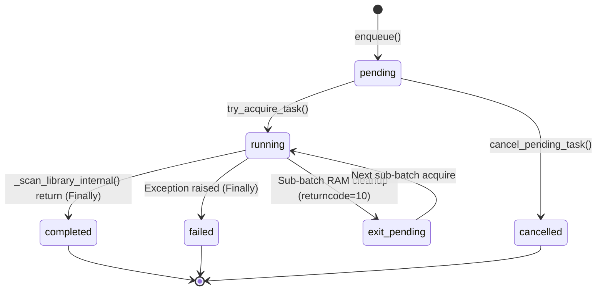

# 📐 스캐너 큐 및 라이브러리 스캔 상태 전이 명세서 (Specification)

이 문서는 BookOasis 백그라운드 스캐너 워커, 스케줄러, 라이브러리 상태 머신(State Machine)의 **모든 상태값 전이 조건 및 교착 방지(Deadlock Prevention) 명세**를 정합하게 정의한 사양서입니다.

---

## 1. 스캐너 태스크 상태 명세 (`scanner_tasks.status`)

`scanner_tasks` 테이블은 백그라운드 워커가 처리하는 개별 스캔 태스크의 대기열 현황을 관리합니다.

| 상태값 (Status) | 의미 및 역할 | 전이 가능 상태 | 전이 트리거 및 안전 보장 메커니즘 |
| :--- | :--- | :--- | :--- |
| **`pending`** | 대기열에 적재되어 실행을 대기 중인 상태 | `running`, `cancelled` | `enqueue()`로 인큐 시 생성. 워커가 `try_acquire_task()` 호출 시 원자적으로 `running`으로 전이 |
| **`running`** | 워커 프로세스가 태스크를 선점하여 실행 중인 상태 | `completed`, `failed`, `exit_pending` | 스캔 실행 구문 및 결과 업데이트가 `try...finally`로 결합되어 실행 완료/오류 시 무조건 `completed`/`failed`로 전이 보장 |
| **`exit_pending`** | Lazy Scanner 메모리 환수(100권 단위) 후 재기동 대기 | `running`, `pending` | RAM 환수 후 서브배치 연속 기동 시 전이. 우선순위에 따라 일반 라이브러리 스캔(`library_scan`)이 있으면 즉시 양보(Yield) |
| **`completed`** | 태스크가 정상적으로 종료된 최종 완료 상태 | `pending` (재인큐 시) | 메인 스캔 스레드 리턴 시 `update_task_result()`에 의해 기록됨. 신규 도서 알림 웹훅/플러그인은 비동기 데몬 스레드로 격리 |
| **`failed`** | 스캔 중 예외, I/O 오류, 경로 미존재로 실패한 상태 | `pending` (재인큐 시) | 예외 발생 시 `finally` 블록에서 `error_message`와 함께 갱신되며, 후속 pending 태스크를 블로킹하지 않음 |
| **`cancelled`** | 사용자가 대기열에서 작업을 취소한 상태 | - | DB 상 취소 기록 후 마감. Redis 팝(Pop) 시 DB 조회가 실패(`None`)하여 차순위 작업으로 즉시 폴백 |

---

## 2. 라이브러리 카테고리 상태 명세 (`libraries.scan_status`)

`libraries` 테이블은 각 카테고리별 실시간 파일 시스템 스캔 상태를 관리합니다.

| 상태값 (Status) | 의미 및 역할 | 전이 가능 상태 | 전이 트리거 및 안전 보장 메커니즘 |
| :--- | :--- | :--- | :--- |
| **`ready`** | 스캔 준비 완료 (정상 유휴 상태) | `scanning` | 대기 중 스캔 기동 시 `update_library_scan_status(..., 'scanning')` 호출로 전이 |
| **`scanning`** | 카테고리 스캔 진행 중 상태 | `ready`, `failed`, `cancelling`, `interrupted` | VFS 새로고침, 파일 시스템 탐색, DB 싱크 수행 단계 |
| **`cancelling`** | 사용자가 스캔 중단 요청 버튼 클릭 시 | `ready` | 엔진 탐색 루프에서 `cancelling` 상태를 조기 감지(Early-exit)하여 안전 중단 후 `ready`로 복구 |
| **`failed`** | 라이브러리 접근/스캔 실패 상태 | `ready`, `scanning` | 스캔 실패 시 기록되며 UI에 경고 표시. 재스캔 시 정상 전이 |
| **`interrupted`** | 서버 재기동/정지로 비정상 마감된 상태 | `ready` ➔ `scanning` | `database.py` 기동 시 `scanning` ➔ `interrupted`로 정리 후 `auto_resume_interrupted_jobs()`가 자동 재개 |

---

## 3. 상태 전이 매트릭스 & 교착 방지 규격 (Deadlock Prevention Matrix)

### 필수 준수 구현 규칙 (Mandatory Implementation Rules)

1. **Decoupling Rule (결합 해제 규칙)**:
   - 스캔 종료 후 수행되는 외연 확장 작업(웹훅 HTTP 통신, 플러그인 훅 디스패치 등)은 **절대 메인 스캐너 스레드에서 동기식으로 실행하지 않는다.**
   - 데몬 백그라운드 스레드(`threading.Thread(daemon=True)`)로 위임하여 메인 스케줄러가 0초 만에 리턴되도록 보장한다.

2. **Finally Guarantee Rule (마감 보장 규칙)**:
   - 워커 루프 내의 태스크 실행(`_process_...`)과 결과 반영(`update_task_result`)은 **반드시 `try ... finally` 구문으로 보호**한다.
   - 예외 발생, 딜레이, 타임아웃 여부와 관계없이 DB 태스크 상태가 `completed` 또는 `failed`로 반드시 갱신되도록 작성한다.

3. **Atomic Task Acquisition Rule (원자적 태스크 선점 규칙)**:
   - 워커가 대기 작업을 채택할 때는 `UPDATE scanner_tasks SET status = 'running' WHERE id = ? AND status IN ('pending', 'exit_pending')`와 같은 **원자적 조건부 쿼리**를 사용해 멀티 워커 환경의 경합(Race Condition)을 차단한다.

4. **Self-Healing on Boot (기동 시 자동 회복 규칙)**:
   - 시스템 재기동 시 잔재하던 비정상 `running` 태스크는 `failed` 처리하고, 카테고리의 `scanning` 상태는 `interrupted` ➔ `ready` 전이 후 **Auto-Resume 체인에 의해 자동 재개**되도록 유지한다.
